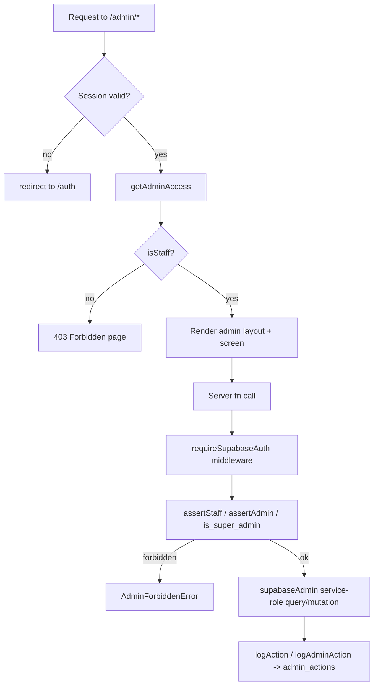

# SAKAN — Admin Console

## Purpose

Documents the staff-only admin console: how access is gated, what each screen does, which server functions it calls, what data it mutates, and how actions are audited.

Sibling docs: [FEATURES.md](./FEATURES.md), [TRANSLATIONS.md](./TRANSLATIONS.md).

## Table of Contents

1. [Access gate & roles](#access-gate--roles)
2. [Request flow](#request-flow)
3. [Screens](#screens)
4. [Audit logging](#audit-logging)
5. [Notes & warnings](#notes--warnings)

---

## Access gate & roles

Roles live in `public.user_roles` as `public.app_role`: `user`, `moderator`, `admin`, `super_admin` (added by a later migration on top of the original `user|moderator|admin` enum).

`src/routes/admin/route.tsx` is the layout route for everything under `/admin/*`:
- `beforeLoad` requires a valid Supabase session, else `redirect({ to: "/auth" })`.
- The component calls `useAdminAccess()`, which invokes the `getAdminAccess` server function (`src/lib/admin/ops.functions.ts`) and renders a **403 Forbidden** screen unless `isStaff` is true.
- The sidebar shows the caller's roles and a "back to app" link.

Two levels of server-side authorization are used consistently across every admin server function:

| Guard | Checks | Used for |
|---|---|---|
| `assertStaff(supabase, userId)` | `is_staff` RPC (true for moderator/admin/super_admin) | Read-heavy/queue screens: dashboard, listing, verification/report review |
| `assertAdmin(supabase, userId)` | `has_role(..., 'admin')` RPC | Destructive/high-trust actions: role changes, account deletion, subscription/payment mutation, broadcast notifications |
| `is_super_admin` RPC (inline) | Highest privilege | Granting the `super_admin` role, platform settings updates |



Both `admin.functions.ts` (legacy Phase-2 surface) and `ops.functions.ts` (Phase-5 expanded surface) exist; current admin routes are wired to `ops.functions.ts` / `ops.server.ts` / `billing.server.ts`, with `admin.functions.ts` / `admin.server.ts` providing the authorization primitives (`assertStaff`, `assertAdmin`) and an overlapping, still-present set of `list*`/`resolve*` operations for users, verifications, reports, and moderation flags.

**Source files:** `src/routes/admin/route.tsx`, `src/lib/admin/admin.functions.ts`, `src/lib/admin/admin.server.ts`, `src/lib/admin/ops.functions.ts`, `src/lib/admin/ops.server.ts`, `src/lib/admin/billing.server.ts`, `src/lib/admin/types.ts`, `src/lib/admin/strings.ts`.

---

## Request flow

Every admin server function follows the same shape:

```ts
export const someAdminAction = createServerFn({ method: "POST" })
  .middleware([requireSupabaseAuth])          // resolves context.supabase / context.userId
  .validator(z.object({ /* zod schema */ }))  // input validation
  .handler(async ({ data, context }) => {
    const { assertStaff /* or assertAdmin */ } = await import("./admin.server");
    const { someAdminAction: run } = await import("./ops.server");
    await assertStaff(context.supabase, context.userId); // re-checked on every call
    return run({ adminId: context.userId, ...data });
  });
```

Reads use the caller's own RLS-bound `supabase` client only for the role check; the actual data read/write in `ops.server.ts` / `admin.server.ts` / `billing.server.ts` uses `supabaseAdmin` (service-role, bypasses RLS) — access control is therefore enforced entirely at the server-function boundary, not via table policies, for admin operations.

---

## Screens

### Dashboard (`/admin/dashboard`)

- **Route:** `src/routes/admin/dashboard.tsx`.
- **Server fn:** `getLiveStats` (`ops.functions.ts` → `ops.server.ts`), polled every 20s.
- **Data:** Read-only aggregate counts (online now, plus whatever `getDashboardStats` in `admin.server.ts` separately exposes: total users, new users 7d, active 24h, subscriptions by plan, revenue this month, open reports, pending verifications, messages 7d, 14-day signup/revenue timeseries) over `profiles`, `subscriptions`, `payments`, `reports`, `verification_requests`, `messages`.
- **Mutations:** None.

### Users (`/admin/users`)

- **Route:** `src/routes/admin/users.tsx`.
- **Server fns:** `listUsersAdvanced`, `runUserAction`, `changeUserRoleV2` (`ops.functions.ts`).
- **Filters:** search, status (`all/active/suspended/shadow_banned`), verified, role, country, sort/direction, paging.
- **Mutations:**
  - `runUserAction` — `suspend`, `unsuspend`, `shadow_ban`, `unshadow_ban`, `verify`, `unverify`, `reset_password`, `force_logout` require `assertStaff`; `delete` requires `assertAdmin`. Mutates `public.profiles` (status/verification flags) and, for delete, the underlying auth user.
  - `changeUserRoleV2` — requires `assertAdmin`; granting `super_admin` additionally requires the caller to already be `is_super_admin`. Upserts/deletes rows in `public.user_roles`.
- **Audit:** Logged via `logAdminAction` (role changes) and equivalent logging inside `runUserAction`.

### User detail (`/admin/user/:id`)

- **Route:** `src/routes/admin/user.$id.tsx`.
- **Server fns:** `getUserDetailFull`, `runUserAction`, `addAdminNote` (`ops.functions.ts`).
- **Data:** Full profile, roles, subscription, recent payments, report counts (as filer and as target), auth email — see `getUserDetail`/`getUserDetailFull` in `admin.server.ts`/`ops.server.ts`.
- **Mutations:** Same `runUserAction` set as the Users screen (scoped to one target), plus `addAdminNote` which appends a staff-only note about the account (`assertStaff`).

### Conversations (`/admin/conversations`)

- **Route:** `src/routes/admin/conversations.tsx`.
- **Server fns:** `listConversations`, `getConversationMessages` (`ops.functions.ts`), both `assertStaff`.
- **Data:** Conversation list (searchable) over `public.conversations`; message transcript for a selected conversation, with optional search, over `public.messages` — read-only moderation/support view. No mutation endpoints.

### Matches (`/admin/matches`)

- **Route:** `src/routes/admin/matches.tsx`.
- **Server fn:** `listMatches` (`ops.functions.ts`), `assertStaff`. Filter: `all/active/inactive`. Read-only view over `public.matches`.

### Reports (`/admin/reports`)

- **Route:** `src/routes/admin/reports.tsx`.
- **Server fns:** `listReportsFull`, `actOnReport` (`ops.functions.ts`); overlapping legacy `listReports`/`resolveReport`/`bulkResolveReports` in `admin.functions.ts`.
- **Filters:** status (`open/reviewing/resolved/dismissed/all`), reason, paging.
- **Mutations:** `actOnReport` (`resolve`, `dismiss`, `warn`, `suspend`, `ban`) updates `public.reports` (`status`, `reviewer_id`, `reviewer_notes`, `resolved_at`) and, for `warn`/`suspend`/`ban`, cascades into user-status changes. All under `assertStaff`.

### Verifications (`/admin/verifications`)

- **Route:** `src/routes/admin/verifications.tsx`.
- **Server fns:** `listVerificationQueue`, `decideVerification` (`ops.functions.ts`); legacy equivalents `listVerifications`/`reviewVerification`/`bulkReviewVerifications` in `admin.functions.ts`.
- **Filters:** status (`pending/approved/rejected/expired/all`), paging.
- **Mutations:** `decideVerification` (`approved`, `rejected`, `expired`, `more_info`) updates `public.verification_requests.status` (and, on approval, `profiles.is_verified`). `assertStaff`.

### Payments (`/admin/payments`)

- **Route:** `src/routes/admin/payments.tsx`.
- **Server fns:** `listPaymentsAdmin`, `getBillingOverview`, `markPaymentRefunded`, `exportPaymentsCsv` (`ops.functions.ts` → `billing.server.ts`).
- **Data:** Payment list with status/provider/search filters; billing overview (MRR/ARR, revenue this month/all-time, refunded total, subscription counts by status, revenue by plan, 12-month revenue series) over `public.payments`, `public.subscriptions`, `public.plans`.
- **Mutations:** `markPaymentRefunded` (requires `assertAdmin`) marks a `public.payments` row refunded and logs the reason. `exportPaymentsCsv` (`assertStaff`) is read-only, returning a CSV string.

### Subscriptions (`/admin/subscriptions`)

- **Route:** `src/routes/admin/subscriptions.tsx`.
- **Server fns:** `getBillingOverview`, `listSubscriptionsAdmin`, `listPlansAdmin` (`assertStaff`), `runSubscriptionAction` (`assertAdmin`) — all in `billing.server.ts`.
- **Mutations:** `runSubscriptionAction` supports `set_status`, `change_plan`, `extend_period`, `set_grace`, `cancel_at_period_end` on a `public.subscriptions` row; every call requires a `reason` string and is logged.

### Featured ads (`/admin/ads`)

- **Route:** `src/routes/admin/ads.tsx`.
- **Server fns:** `listFeaturedAdsAdmin`, `reviewFeaturedAd` (module inferred from `ads.functions.ts`/`ads.server.ts`; wired through `ops.functions.ts`).
- **Mutations:** `reviewFeaturedAd` approves/rejects or otherwise moderates a featured-ad placement submitted by a member (see FEATURES.md → Featured Ads).

### Notifications (`/admin/notifications`)

- **Route:** `src/routes/admin/notifications.tsx`.
- **Server fns:** `listAdminNotifications` (`assertStaff`), `broadcastNotification` (`assertAdmin`).
- **Data:** Filterable notification feed (`all/unread/read/system/verification/match/message/like`).
- **Mutations:** `broadcastNotification` creates `public.notifications` rows for an audience (`all`, `country`, `premium`, `moderators`, `user`) with a title/body — the platform's mass-messaging tool.

### Analytics (`/admin/analytics`)

- **Route:** `src/routes/admin/analytics.tsx`.
- **Server fn:** `getAnalytics` (`assertStaff`), range of 7/30/90 days. Read-only aggregate reporting (signups, engagement, revenue trends, etc., depending on `ops.server.ts` implementation).

### Activity log (`/admin/activity`)

- **Route:** `src/routes/admin/activity.tsx`.
- **Server fn:** `listActivity` (`assertStaff`), with `source: "admin" | "system"` and search/paging.
- **Data:** Reads from `public.admin_actions` (source `admin`) and `public.activity_logs` (source `system`) — see [Audit logging](#audit-logging).

### Settings (`/admin/settings`)

- **Route:** `src/routes/admin/settings.tsx`.
- **Server fns:** `getPlatformSettings` (`assertStaff`), `updatePlatformSettings` (requires `is_super_admin` specifically, checked inline rather than via `assertAdmin`).
- **Mutations:** `updatePlatformSettings` patches platform-wide config: `support_email`, `maintenance_mode`, `default_language` (`ar/en/de/fr`), `registration_enabled`, `verification_required`, `max_gallery_photos`, `max_image_mb`, `allowed_image_types`, `notify_defaults`.

### Index (`/admin`)

- **Route:** `src/routes/admin/index.tsx` — redirects to `/admin/dashboard`.

---

## Audit logging

Two append-only, staff-readable tables (defined in `supabase/migrations/20260802162604_...sql`, RLS-protected by `admin_actions_select_staff` / `activity_logs_select_staff` policies):

| Table | Written by | Columns of note | Purpose |
|---|---|---|---|
| `public.admin_actions` | `logAction()` (`admin.server.ts`) / `logAdminAction()` (`ops.server.ts`) after every state-changing admin call | `admin_id`, `action` (e.g. `user.suspend`, `report.resolved`, `role.grant`), `target_table`, `target_id`, `details` (JSON), `created_at` | Immutable record of every admin/staff action for accountability and support investigations |
| `public.activity_logs` | Application/system events (not staff-initiated) | `user_id`, event payload, `created_at` | General platform activity trail surfaced alongside admin actions in the Activity screen |

The Activity screen (`/admin/activity`) is the UI for both tables via the `source` filter. Every mutating admin server function in this document writes an `admin_actions` row with a dot-namespaced `action` string (`user.suspend`, `user.ban`, `role.grant`, `role.revoke`, `report.resolved`, `report.dismissed`, etc.) and a `details` JSON blob capturing the reason/notes supplied by the operator.

---

## Notes & warnings

- `admin.functions.ts`/`admin.server.ts` (Phase 2) and `ops.functions.ts`/`ops.server.ts` (Phase 5) both define overlapping operations for users, verifications, reports, and moderation flags. Current route components import from `ops.functions.ts`; the older `admin.functions.ts` surface still exists and is authoritative for `AdminForbiddenError`, `assertStaff`, and `assertAdmin`, which `ops.server.ts` reuses.
- `updatePlatformSettings` and granting `super_admin` are the only operations gated by `is_super_admin` rather than the coarser `assertAdmin`; treat these as the highest-privilege actions in the console.
- Because admin server functions use `supabaseAdmin` (service role) once authorized, there is no RLS safety net inside these handlers — the `assertStaff`/`assertAdmin`/`is_super_admin` check at the top of each handler **is** the authorization boundary.
