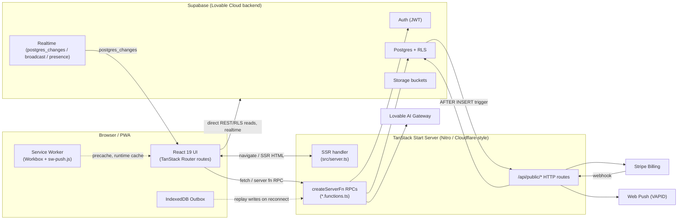
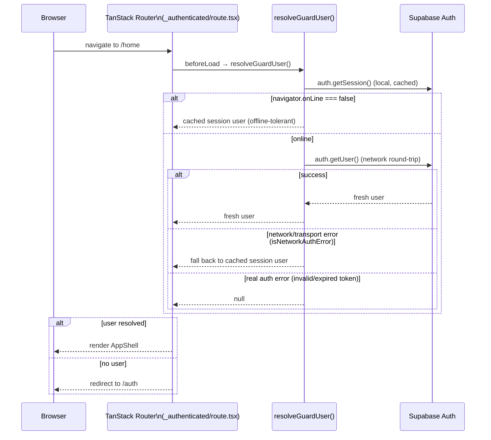
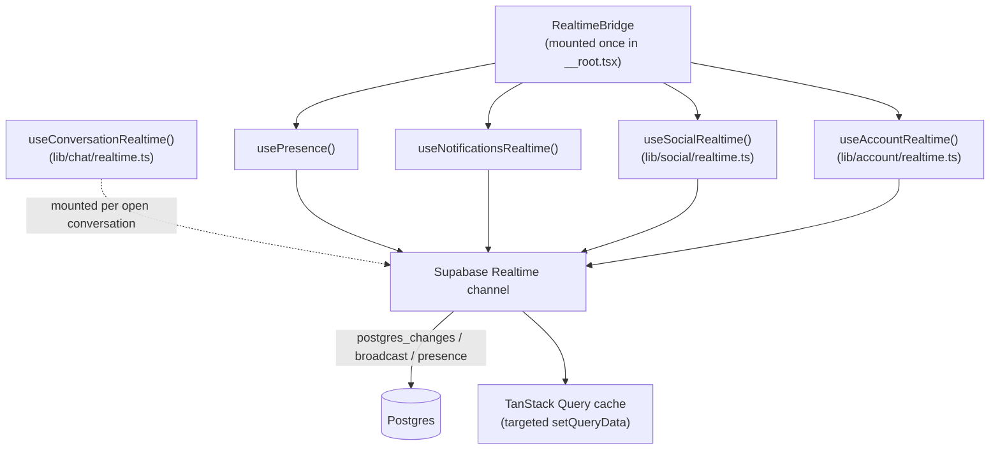
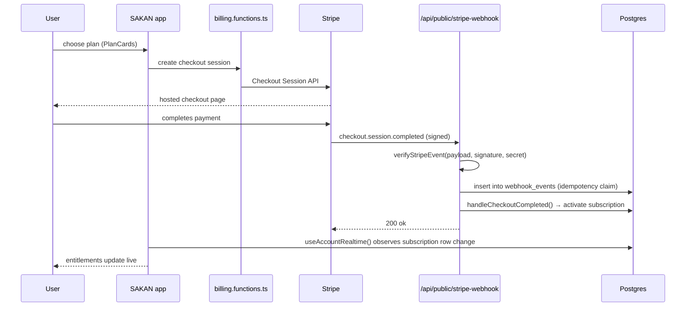
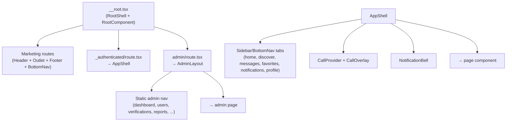
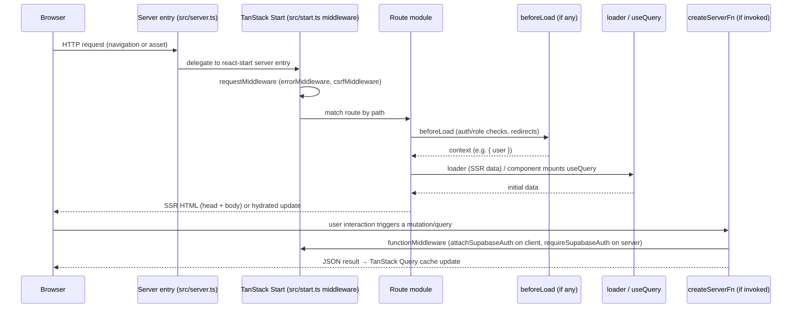

# SAKAN — System Architecture

## Purpose

This document describes the overall architecture of SAKAN, an international
marriage/matchmaking platform built as a single TanStack Start (v1) application
with a Supabase backend ("Lovable Cloud"). It covers the frontend rendering
model, the server-function/API layer, authentication (including offline
tolerance), realtime data flow, billing, push notifications, offline support,
PWA behavior, storage, AI features, and caching. It is intended for engineers
onboarding onto the codebase or making cross-cutting changes.

Only implementation that exists in the repository at `/dev-server` is
described here. Where a feature is partially built, it is called out
explicitly as **Partially implemented**.

## Table of Contents

1. [High-Level Overview](#high-level-overview)
2. [Frontend Architecture](#frontend-architecture)
3. [Rendering Strategy: SSR, Hydration & Route-Level SSR Opt-out](#rendering-strategy-ssr-hydration--route-level-ssr-opt-out)
4. [Server Layer: `createServerFn` and API Routes](#server-layer-createserverfn-and-api-routes)
5. [Database](#database)
6. [Authentication & Session Flow](#authentication--session-flow)
7. [Authorization & Admin Roles](#authorization--admin-roles)
8. [Realtime Architecture](#realtime-architecture)
9. [Billing (Stripe)](#billing-stripe)
10. [Push Notifications](#push-notifications)
11. [Offline Support & the Outbox](#offline-support--the-outbox)
12. [PWA & Service Worker](#pwa--service-worker)
13. [Storage Buckets](#storage-buckets)
14. [AI Features](#ai-features)
15. [Component Architecture](#component-architecture)
16. [Server Function Architecture & Naming Conventions](#server-function-architecture--naming-conventions)
17. [Request Lifecycle](#request-lifecycle)
18. [Data Flow](#data-flow)
19. [Caching: TanStack Query + Workbox](#caching-tanstack-query--workbox)
20. [Notes & Troubleshooting](#notes--troubleshooting)
21. [Cross-References](#cross-references)

## High-Level Overview



Key facts:

- **Single deployable**: one TanStack Start app serves marketing pages, the
  authenticated app shell, the admin console, and a small set of public HTTP
  API routes (`src/routes/api/public/*`).
- **Backend**: Supabase provides Postgres (with Row Level Security), Auth,
  Realtime and Storage. Browser code reads most data directly from Supabase
  under RLS; privileged writes and admin operations go through
  `createServerFn` RPCs that re-verify identity server-side.
- **Billing**: Stripe Checkout + a signature-verified webhook
  (`src/routes/api/public/stripe-webhook.ts`).
- **Push**: Web Push via VAPID, fanned out from a Postgres trigger that calls
  `src/routes/api/public/push-dispatch.ts`.
- **Offline-first**: an IndexedDB write outbox (`src/lib/outbox.ts`) plus a
  Workbox service worker make the app usable with intermittent connectivity.

## Frontend Architecture

- **Framework**: TanStack Start v1 on React 19, Vite 7, Tailwind v4.
- **Routing**: file-based routing under `src/routes/` (see
  [ROUTES.md](./ROUTES.md) for the full route table). `src/routeTree.gen.ts`
  is generated by the TanStack Router Vite plugin — never edited by hand.
- **Root shell**: `src/routes/__root.tsx` defines `shellComponent` (the raw
  `<html>` document, RTL Arabic by default) and `component` (`RootComponent`),
  which wires up global providers: `QueryClientProvider`, `AuthProvider`,
  `I18nProvider`, `PwaProvider`, plus always-mounted singletons:
  `LocaleSync`, `LocalizedSeo`, `RealtimeBridge`, `OfflineBanner`,
  `InstallPrompt`, `UpdateBanner`, `AppBadgeSync`, and a `Toaster`.
- **Two visual shells**:
  - Marketing/public pages render `Header` + `Footer` + a floating
    `BottomNav` (mounted post-hydration only, to keep SSR markup
    deterministic).
  - Authenticated routes (`/home`, `/discover`, `/messages`, `/matches`,
    `/favorites`, `/profile`, `/settings`, `/billing`, `/notifications`,
    `/onboarding`, `/auth`, `/admin`) render inside `AppShell`
    (`src/components/app/AppShell.tsx`), which owns its own sidebar/bottom
    tab bar and suppresses the marketing chrome (`APP_SHELL_PREFIXES` in
    `__root.tsx`).
- **State/data**: TanStack Query for all server state; local component state
  and small context providers (`AuthProvider`, `I18nProvider`, `CallProvider`)
  for everything else. There is no global client-state library (Redux/Zustand).
- **Styling**: Tailwind v4 utility classes plus a small set of custom
  `glass-card` / `chip-glass` utility classes; shadcn/ui-derived primitives
  live under `src/components/ui/`.

## Rendering Strategy: SSR, Hydration & Route-Level SSR Opt-out

TanStack Start SSRs every route by default. Individual routes opt out with
`ssr: false` when they depend entirely on client-only state (browser session,
`indexedDB`, `navigator`) or must never be indexed:

| Route | `ssr: false`? | Reason |
|---|---|---|
| `/_authenticated/*` (via `_authenticated/route.tsx`) | Yes | Auth state is resolved client-side (`resolveGuardUser`), including the offline-tolerant fallback. |
| `/admin/*` (via `admin/route.tsx`) | Yes | Staff-only console; guarded by a client-side Supabase call. |
| `/auth/callback` | Yes | Finishes an OAuth/magic-link redirect using browser-only session state. |
| `/auth/reset-password` | Yes | Requires an in-browser recovery session. |
| `/offline` | Yes | Only ever shown while the network is down. |

All other public marketing/content routes (`/`, `/search`, `/pricing`,
`/about`, `/guide`, `/member/$id`, legal pages) are server-rendered so search
engines and social crawlers receive full HTML plus `head()` metadata
(title/description/Open Graph/Twitter, and JSON-LD on `/pricing`).

Hydration notes:

- `RootComponent` renders the `BottomNav` only after `useEffect` sets
  `mounted = true`, avoiding SSR/CSR markup mismatches caused by client-only
  session/safe-area state.
- `src/router.tsx` (`getRouter`) constructs the `QueryClient` and
  `TanStackRouter` used on both server and client, with
  `defaultPreload: "intent"` (routes preload on link hover/focus) and
  `scrollRestoration: true`.
- `src/server.ts` wraps TanStack Start's generated server entry
  (`@tanstack/react-start/server-entry`) to defend against h3 swallowing
  in-handler exceptions into an opaque `{"unhandled":true}` 500 JSON body;
  it detects that shape and re-renders a proper HTML error page
  (`src/lib/error-page.ts`) instead.
- `src/start.ts` is the TanStack Start configuration entry point. Declaring it
  opts the app out of Start's default CSRF middleware auto-install, so the
  file re-adds `createCsrfMiddleware` explicitly (scoped to server functions)
  alongside a global error-catching `requestMiddleware` and the
  `attachSupabaseAuth` `functionMiddleware` (see below).

## Server Layer: `createServerFn` and API Routes

There are two distinct kinds of server-side entry points:

1. **`createServerFn` RPCs** (`src/lib/**/*.functions.ts`) — typed,
   validated remote procedure calls invoked from client code via
   `useServerFn` / direct import. Every server function:
   - Is registered with `.middleware([requireSupabaseAuth])` when it needs an
     authenticated caller (see `src/integrations/supabase/auth-middleware.ts`).
   - Validates its input with a `zod` schema via `.validator(...)`.
   - Delegates business logic to a sibling `*.server.ts` module, imported
     lazily inside the handler (`await import("./ops.server")`) to keep
     server-only code out of the client bundle graph.
   - Re-checks authorization server-side (e.g. `assertStaff`, `assertAdmin`)
     even though the UI already gated navigation — the RPC is the real
     trust boundary.

   Example (`src/lib/admin/ops.functions.ts`):
   ```ts
   export const runUserAction = createServerFn({ method: "POST" })
     .middleware([requireSupabaseAuth])
     .validator(
       z.object({
         targetId: z.string().uuid(),
         action: z.enum([...]),
         reason: z.string().max(500).optional(),
       }),
     )
     .handler(async ({ data, context }) => {
       const { assertStaff, assertAdmin } = await import("./admin.server");
       const { runUserAction: run } = await import("./ops.server");
       if (data.action === "delete") await assertAdmin(context.supabase, context.userId);
       else await assertStaff(context.supabase, context.userId);
       return run({ adminId: context.userId, ...data });
     });
   ```

2. **File-based API routes** (`src/routes/api/public/*.ts`) — plain HTTP
   handlers exported as `server.handlers.{GET,POST,...}` on a
   `createFileRoute`. These live outside the authenticated app and are used
   for machine-to-machine callbacks that cannot carry a Supabase session:
   - `POST /api/public/stripe-webhook` — Stripe event receiver.
   - `POST /api/public/push-dispatch` — push fan-out, called by a Postgres
     trigger with a shared-secret header (`x-push-token`), not a user JWT.
   - `GET /sitemap.xml` (`src/routes/sitemap[.]xml.ts`) — dynamic sitemap
     handler under the standard route tree, not `/api/public`.

Both `attachSupabaseAuth` (client middleware, attaches `Authorization: Bearer
<access_token>` to every server-fn call) and `requireSupabaseAuth` (server
middleware, validates the bearer JWT via `supabase.auth.getClaims` and injects
`{ supabase, userId, claims }` into the handler context) are generated
integration files — comments in both mark them "automatically generated. Do
not edit it directly."

## Database

- **Engine**: Postgres via Supabase, with Row Level Security policies
  enforced on every table accessed directly from the browser.
- **Schema evolution**: SQL migrations under `supabase/migrations/` (35 files
  at the time of writing), timestamp-prefixed and applied in order.
- **Two Supabase clients**:
  - `src/integrations/supabase/client.ts` — anonymous/publishable-key client
    used in the browser and for SSR reads; respects RLS.
  - `src/integrations/supabase/client.server.ts` (`supabaseAdmin`) —
    service-role client used only inside `*.server.ts` modules for
    privileged operations (admin actions, webhook processing, push dispatch).
- **Generated types**: `src/integrations/supabase/types.ts` provides the
  `Database` type used throughout `*.server.ts` and query modules for
  end-to-end type safety.
- **Idempotency pattern**: the Stripe webhook claims each `event.id` in a
  `webhook_events` table before processing (unique-constraint insert; a
  `23505` conflict means "already handled").

## Authentication & Session Flow

Sign-in uses Supabase Auth (email/password + magic link/OAuth via
`src/integrations/lovable`). Two complementary mechanisms keep the app usable
under real-world network conditions:



- `src/lib/auth/offline-session.ts` exports `resolveGuardUser()`, used by
  `src/routes/_authenticated/route.tsx`'s `beforeLoad`. It deliberately
  distinguishes "no network" (`isOffline()`, `navigator.onLine === false`) and
  "transport failure" (`isNetworkAuthError`, matching Supabase's
  `AuthRetryableFetchError` or a raw fetch `TypeError`) from a genuinely
  invalid/expired session, so a dead network never looks like a sign-out and
  bounces the user to `/auth`.
- `src/hooks/useAuth.tsx` (`AuthProvider`) is the single source of the live
  `Session`/`User` object for React components. It subscribes to
  `supabase.auth.onAuthStateChange`, calls `router.invalidate()` on
  `SIGNED_IN` / `SIGNED_OUT` / `USER_UPDATED`, and clears/invalidates the
  TanStack Query cache accordingly. `signOut()` cancels in-flight queries and
  clears the cache before calling `supabase.auth.signOut()`.
- Route guards:
  - `/_authenticated` (`src/routes/_authenticated/route.tsx`): `ssr: false`,
    `beforeLoad` calls `resolveGuardUser()`, redirects to `/auth` when no user
    is resolved, injects `{ user }` into the route context, renders `AppShell`.
  - `/admin` (`src/routes/admin/route.tsx`): `ssr: false`, `beforeLoad` calls
    `supabase.auth.getUser()` directly (no offline fallback — admin work
    requires a live connection) and redirects unauthenticated visitors to
    `/auth`; staff/role membership is then checked client-side via
    `getAdminAccess()` and rendered as a "Forbidden" state for non-staff.
- On the server, every `createServerFn` that needs identity uses
  `requireSupabaseAuth`, which independently re-validates the bearer JWT via
  `supabase.auth.getClaims(token)` — the client-side guard is a UX
  convenience only, not the trust boundary.

## Authorization & Admin Roles

- Roles (`user`, `moderator`, `admin`, `super_admin`) are stored in a
  `user_roles` table and checked via Postgres RPCs `is_staff` /
  `is_super_admin`, plus helper assertions `assertStaff` / `assertAdmin` in
  `src/lib/admin/admin.server.ts`.
- Admin server functions (`src/lib/admin/ops.functions.ts`,
  `billing.server.ts`) apply the least-privilege pattern per action: read
  operations require `assertStaff`; destructive or financial actions
  (`delete` user, `broadcastNotification`, `runSubscriptionAction`,
  `markPaymentRefunded`, granting `super_admin`) require `assertAdmin` and,
  for the `super_admin` role itself, an explicit `is_super_admin` RPC check.
- Every privileged mutation is written to an `admin_actions` audit log via
  `logAdminAction()`.

## Realtime Architecture



- `src/components/RealtimeBridge.tsx` mounts four always-on subscriptions for
  every signed-in session (all hooks no-op signed out): presence/heartbeat,
  the notification stream, the social graph (likes, matches, favorites), and
  account state (subscription, payments, verification, featured-banner
  queue).
- `src/lib/chat/realtime.ts` additionally provides
  `useConversationRealtime`, mounted only while a specific conversation route
  (`/messages/$id`) is open. It listens to `postgres_changes` for that
  conversation's messages plus a broadcast/presence channel for typing
  indicators, and applies **targeted** cache writes (`upsertPage`) into the
  TanStack Query cache instead of invalidating/refetching the whole list.
- Realtime writes never bypass RLS: subscriptions run through the same
  anonymous/publishable Supabase client used for reads.

## Billing (Stripe)



- Client: `src/components/billing/PlanCards.tsx`, `useSubscription`
  (`src/hooks/useSubscription.ts`) combines `plansQuery` and
  `mySubscriptionQuery` (`src/lib/billing/queries.ts`) into a single
  `entitlements` object (`resolveEntitlements`), falling back to
  `FREE_ENTITLEMENTS` for signed-out/no-plan users.
- Server: `src/lib/billing/billing.functions.ts` (`createServerFn` RPCs
  used by the client, e.g. checkout creation), `stripe.server.ts` (Stripe
  SDK wrapper + `verifyStripeEvent` signature verification),
  `customers.server.ts` (Stripe customer ↔ Supabase user mapping),
  `provider.server.ts` (billing-provider abstraction), and
  `webhook.server.ts` (event handlers: `handleCheckoutCompleted`,
  `handleInvoicePaid`, `handleInvoiceFailed`,
  `handleSubscriptionUpdated`, `handleSubscriptionDeleted`,
  `handleChargeRefunded`).
- The public webhook endpoint (`src/routes/api/public/stripe-webhook.ts`)
  never trusts the payload until `verifyStripeEvent` succeeds, claims the
  event id in `webhook_events` for idempotency (Stripe retries deliveries),
  dispatches to the matching handler by `event.type`, and rolls the claim
  back (`delete` the `webhook_events` row) on handler failure so Stripe's
  retry can reprocess it.
- Admin billing operations (refunds, plan changes, grace periods) live in
  `src/lib/admin/billing.server.ts`, exposed through
  `src/lib/admin/ops.functions.ts` and gated by `assertStaff`/`assertAdmin`.

## Push Notifications

- **Trigger source**: Postgres `AFTER INSERT` triggers on the
  `notifications` table call `POST /api/public/push-dispatch` with the new
  row's id.
- **Auth**: the dispatch endpoint is unauthenticated by Supabase JWT (it runs
  as a database-initiated webhook); it instead does a constant-time
  comparison (`safeEqual`) of the `x-push-token` header against
  `PUSH_DISPATCH_TOKEN`.
- **Fan-out** (`src/lib/push/webpush.server.ts`, `sendPushToUser`): sends a
  Web Push message to every active device subscription for the
  notification's `user_id`, using VAPID keys (`vapidConfigured()` guards
  against missing configuration). Do-Not-Disturb members
  (`presence_status = 'dnd'`) are stamped as handled without ever being
  pushed. Locale (`ar`/other) drives `lang`/`dir` on the payload. A deep link
  (`targetUrl`) is derived per notification `type` (message → conversation,
  match → `/matches`, like/profile_view → `/notifications`, premium →
  `/billing`).
- **Delivery bookkeeping**: `push_sent_at` is stamped only once a row is
  genuinely finished — a failed send to at least one still-registered device
  within `GIVE_UP_AFTER_MS` (15 minutes) is left unstamped so it stays
  visible as pending and can be retried.
- **Client-side registration**: `src/lib/push/push-browser.ts` and
  `src/components/pwa/PushToggle.tsx` manage the browser
  `PushSubscription` (subscribe/unsubscribe), and
  `src/lib/push/push.functions.ts` persists it server-side.
- **Service worker piece**: `public/sw-push.js` handles `push` and
  `notificationclick` events and is pulled into the generated Workbox worker
  via `importScripts` (see [PWA & Service Worker](#pwa--service-worker)).

## Offline Support & the Outbox

- `src/lib/outbox.ts` installs a single `window.fetch` interceptor
  (`installOfflineWriteInterceptor`) that transparently captures every
  failed `POST`/`PUT`/`PATCH`/`DELETE` request — server-fn RPCs and direct
  Supabase REST writes alike — into an IndexedDB store (`sakan-outbox`),
  as long as the URL doesn't match `SKIP_PATTERNS` (auth token endpoints,
  Storage binary uploads, Realtime, and anything Stripe — none of which are
  safe to blindly replay) and the body is a serializable string under
  `MAX_BODY_BYTES` (512 KB).
- Replay (`flushOutbox()`) happens on the browser `online` event, on a
  Background Sync event (registered via `registration.sync.register(...)`
  when supported), or from the service worker itself with no tab open. Each
  entry is retried up to `MAX_ATTEMPTS` (8); a `4xx` response drops the entry
  permanently (client error, retrying won't help), a `5xx` bumps the attempt
  counter and stops the batch (still likely offline/overloaded), and success
  removes the entry and fires a `sakan:outbox-flushed` DOM event that UI
  (e.g. `OfflineBanner`) can listen for.
- `src/components/OfflineBanner.tsx` surfaces connectivity state and queued
  write count (`outboxSize()`) to the user.
- `resolveGuardUser()` (see [Authentication](#authentication--session-flow))
  is the read-side complement: it prevents a dead network from being
  misread as a signed-out state.

## PWA & Service Worker

- Built with `vite-plugin-pwa` in `generateSW` mode (`vite.config.ts`):
  Workbox precaches all built static assets plus two synthetic
  `additionalManifestEntries` (`/offline`, `/`) since SSR means there is no
  static HTML on disk to glob.
- Runtime caching strategies:
  | Resource | Strategy | Notes |
  |---|---|---|
  | HTML navigations | `NetworkFirst` (8s timeout) | Falls back to `/offline.html` (or `/`) on error via a custom `handlerDidError` plugin — a static, JS-free page for a cold offline start on a never-visited URL. |
  | Images | `CacheFirst` | 150 entries / 30 days. |
  | Google Fonts CSS | `StaleWhileRevalidate` | |
  | Google Fonts files | `CacheFirst` | 1 year. |
  | Supabase Storage media | `StaleWhileRevalidate` | Avatars, gallery, wallpapers. |
- Hand-written worker logic that Workbox does not generate (push,
  notification clicks, background/periodic sync) lives in
  `public/sw-push.js` and is merged into the single generated worker
  (`/sw.js`) via `importScripts`, so there is exactly one service worker.
- `src/lib/pwa/register.ts` is the **only** registrar
  (`startServiceWorker`). It refuses to install in dev, inside an iframe, on
  known Lovable preview hostnames, or when `?sw=off` is present — in all of
  those cases it actively unregisters any existing worker and clears
  `sakan-*`/`workbox-*` caches, so a stale worker can never strand a preview.
  On a real update it fires `sakan:update-ready` (consumed by
  `src/components/pwa/UpdateBanner.tsx`) instead of silently reloading, and
  registers Background Sync + (where permitted) Periodic Background Sync
  tags for outbox replay and content refresh.
- `src/components/pwa/PwaProvider.tsx`, `InstallPrompt.tsx`,
  `UpdateBanner.tsx`, and `AppBadgeSync.tsx` (app icon badge count via
  `src/lib/pwa/badge.ts`) wire this into the UI.
- `public/manifest.webmanifest` remains the authoritative app manifest
  (name, icons, shortcuts, screenshots); `vite-plugin-pwa`'s `manifest:
  false` option defers to it rather than generating one.

## Storage Buckets

Supabase Storage buckets referenced in the codebase (all accessed with
signed URLs, generated on demand rather than public links):

| Bucket | Used by | Purpose |
|---|---|---|
| `avatars` | `useNotifications.ts`, `onboarding.tsx`, `profile.edit.tsx` | Profile avatar images. |
| `gallery` | `gallery-queries.ts`, `profile/appearance.ts`, `profile.edit.tsx` | Additional profile photos. |
| `wallpapers` | `chat/wallpaper-queries.ts` | Per-conversation chat wallpaper images. |
| *(dynamic)* | `admin/ops.server.ts` (`createSignedUrl(bucket, path)`) | Admin views signing arbitrary member-owned objects for moderation. |

Chat attachments also use signed URLs (`chat/queries.ts`,
`createSignedUrls`/`createSignedUrl`) for message media.

## AI Features

All AI code lives under `src/lib/ai/` and is powered by the **Lovable AI
Gateway**, an OpenAI-compatible chat-completions endpoint
(`src/lib/ai/gateway.server.ts`):

- `gateway.server.ts` — server-only `chatCompletion()` wrapper: retries once
  on `5xx`, distinguishes `rate_limited` (`429`), `payment_required` (`402`),
  and generic `failed` outcomes via a typed `GatewayError`; supports
  structured output via `response_format: json_schema`; `parseJsonContent`
  defensively strips Markdown code fences before `JSON.parse`.
- `prompts.ts` — shared prompt templates and `DEFAULT_AI_MODEL`.
- `assist-strings.ts` — localized UI copy for AI features.
- Feature modules, each pairing a `*.functions.ts` (client-callable
  `createServerFn`s) with `*-helpers.server.ts` (prompt construction, gateway
  calls, response parsing):
  - `coaching.functions.ts` / `coaching-helpers.server.ts` — profile/bio
    coaching suggestions, surfaced in `src/components/profile/BioAssistant.tsx`.
  - `matchmaking.functions.ts` / `matchmaking-helpers.server.ts` — AI-assisted
    match recommendations, surfaced in
    `src/components/search/AiRecommendations.tsx`.
  - `moderation.functions.ts` / `moderation-helpers.server.ts` — content
    moderation checks.
  - `translate.functions.ts` — message/content translation.
  - `visibility.server.ts` — server-side gating of which AI features are
    exposed (e.g. by plan/entitlement).
- The chat composer's `src/components/chat/AiSuggestBar.tsx` consumes these
  server functions for reply suggestions.

> **Note:** AI Gateway calls require the `LOVABLE_API_KEY` environment
> variable; its absence throws a `GatewayError("failed", ...)` rather than
> silently degrading, so AI features fail loudly if misconfigured.

## Component Architecture



- **`src/components/ui/`** — low-level shadcn/ui-derived primitives (button,
  dialog, sheet, table, form, etc.), style-only, no business logic.
- **Feature component folders** (`chat/`, `calls/`, `social/`, `search/`,
  `billing/`, `notifications/`, `presence/`, `profile/`, `ads/`, `pwa/`,
  `admin/`) each own their own presentational components and colocate
  `strings.ts` (localized copy) where needed.
- **`AppShell`** (`src/components/app/AppShell.tsx`) is the largest
  structural component: it renders the sidebar/bottom navigation tabs
  (`TABS`), wraps children in `CallProvider` (WebRTC call state,
  `src/lib/calls/CallProvider.tsx`) and mounts `CallOverlay`, and reads
  unread counts (`useUnreadCount`) and profile/avatar data
  (`myProfileQuery`, `avatarUrlQuery`) to render the shell chrome.
- Singleton, always-mounted components are declared once in `__root.tsx`
  (`RealtimeBridge`, `OfflineBanner`, `LocaleSync`, `LocalizedSeo`,
  `PwaProvider`'s children) rather than per-route, so they persist across
  client-side navigations.

## Server Function Architecture & Naming Conventions

See [FOLDER_STRUCTURE.md](./FOLDER_STRUCTURE.md#naming-conventions) for the
full naming convention table. In summary, each feature under `src/lib/<feature>/`
tends to have some subset of:

- `<feature>.functions.ts` — the client-safe `createServerFn` surface
  (imported by React components/hooks). Only validation schemas and thin
  glue live here; the file is safe to appear in the client dependency graph
  because heavy/server-only logic is lazily `import()`-ed inside handlers.
- `<feature>.server.ts` — server-only implementation (uses
  `supabaseAdmin`, `process.env` secrets, third-party SDKs). Never imported
  from a route component directly.
- `queries.ts` — TanStack Query `queryOptions` factories for **direct**
  browser reads against Supabase (RLS-protected), used with `useQuery`.
- `realtime.ts` — `useXRealtime()` hooks subscribing to Supabase Realtime
  and patching the TanStack Query cache.
- `strings.ts` — localized copy for that feature's UI.
- `types.ts` — shared TypeScript types for the feature.

## Request Lifecycle



## Data Flow

- **Reads**: components call `useQuery(someQuery())` where `someQuery` is a
  `queryOptions` factory from a feature's `queries.ts`, hitting Supabase
  directly under RLS (no server round trip needed for most reads).
- **Realtime updates**: `RealtimeBridge` and per-page realtime hooks patch
  the same TanStack Query cache keys that `queries.ts` populates, so UI
  updates without a refetch.
- **Writes**: components call a `createServerFn` from a feature's
  `*.functions.ts` (via `useServerFn` or awaiting the exported function
  directly), which validates input, re-authenticates/re-authorizes, performs
  the mutation (often via `supabaseAdmin` to bypass RLS safely on the
  server), and returns a result the caller uses to update the query cache
  (`invalidateQueries` / `setQueryData`).
- **Offline writes**: if the write's underlying `fetch` fails, the outbox
  interceptor queues it transparently (see [Offline Support](#offline-support--the-outbox)).

## Caching: TanStack Query + Workbox

Two independent caching layers cooperate:

1. **TanStack Query** (`src/router.tsx`): `staleTime: 60_000`,
   `gcTime: 10 * 60_000`, `refetchOnWindowFocus: false`,
   `refetchOnReconnect: true`. Retries skip `4xx` client errors entirely and
   otherwise retry up to twice with exponential backoff
   (`min(1000 * 2^attempt, 8000)` ms). Mutations never auto-retry
   (`mutations: { retry: 0 }`) since replay safety is handled by the outbox
   instead. Router-level preloading (`defaultPreload: "intent"`,
   `defaultPreloadStaleTime: 30_000`) warms the cache on link hover/focus.
2. **Workbox / service worker** (see [PWA & Service Worker](#pwa--service-worker)):
   caches build artifacts, navigations, images, fonts, and Supabase Storage
   media at the HTTP layer, independent of and beneath the Query cache.

These layers are complementary: Query caching avoids redundant network
round-trips within a session; the service worker cache keeps the app usable
across reloads and offline.

## Notes & Troubleshooting

- **"Missing Supabase environment variable(s)"**: thrown by both
  `client.ts` and `auth-middleware.ts` when `SUPABASE_URL` /
  `SUPABASE_PUBLISHABLE_KEY` (or their `VITE_`-prefixed client equivalents)
  are absent. Connect Supabase in Lovable Cloud to populate them.
- **AI features fail with `GatewayError`**: check `LOVABLE_API_KEY` is set;
  a `402` means AI Gateway credits are exhausted, `429` means rate-limited.
- **Push not delivered**: confirm `vapidConfigured()` returns true and that
  `PUSH_DISPATCH_TOKEN` matches between the Postgres trigger configuration
  and the deployed environment; also check the target member's
  `presence_status` is not `dnd`.
- **Stripe webhook returns `webhook_not_configured`**: `STRIPE_WEBHOOK_SECRET`
  is not set in the environment.
- **A signed-in user is bounced to `/auth` while offline**: this should not
  happen given `resolveGuardUser`; if it does, check that
  `navigator.onLine` is reporting correctly and that a cached Supabase
  session actually exists in `localStorage`.
- **Service worker seems stuck on an old build**: the app deliberately
  refuses to register a worker in dev/preview/iframe contexts; use
  `?sw=off` to force-unregister on any host if debugging a stale worker in
  a production-like deployment.

## Cross-References

- [FOLDER_STRUCTURE.md](./FOLDER_STRUCTURE.md) — directory-by-directory and
  file-by-file breakdown, naming conventions.
- [ROUTES.md](./ROUTES.md) — full route table with metadata and permissions.
