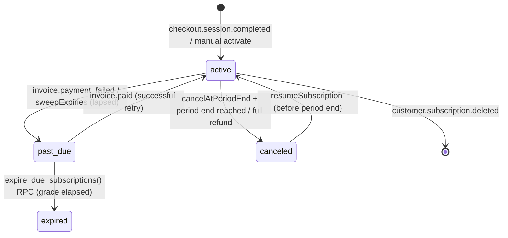
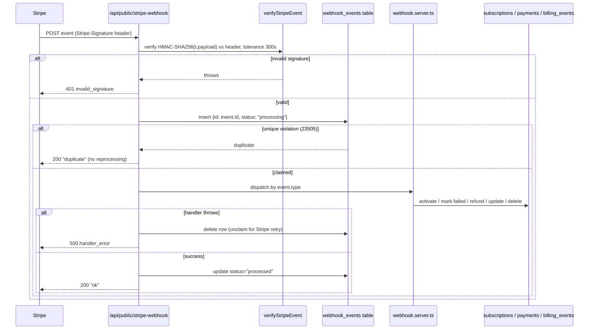

# Billing — Subscriptions, Checkout & Stripe Webhooks

## Purpose

SAKAN's billing layer is provider-agnostic (`src/lib/billing/provider.server.ts`)
with Stripe as the currently implemented payment provider. This document
describes checkout, the hosted billing portal, subscription state machine,
renewals, grace periods, refunds, webhook idempotency, customer mapping and
the plan/entitlement matrix — as actually implemented, not aspirationally.

## Table of Contents

1. [Architecture Overview](#architecture-overview)
2. [Plans & Entitlements](#plans--entitlements)
3. [Checkout](#checkout)
4. [Billing Portal](#billing-portal)
5. [Subscription State Machine](#subscription-state-machine)
6. [Renewals](#renewals)
7. [Grace Period & Expiry Sweep](#grace-period--expiry-sweep)
8. [Refunds](#refunds)
9. [Webhook Event Lifecycle](#webhook-event-lifecycle)
10. [Idempotency](#idempotency)
11. [Customer Mapping](#customer-mapping)
12. [Billing UI](#billing-ui)
13. [Failure Handling](#failure-handling)
14. [Troubleshooting](#troubleshooting)
15. [Related Documents](#related-documents)

## Architecture Overview

| Module | Responsibility |
|---|---|
| `src/lib/billing/types.ts` | `PlanCode`, `PlanLimits`, `Entitlements`, `Subscription`, `Invoice`, `BillingEvent` types; `entitlementsFor()`; `formatPrice()`. |
| `src/lib/billing/provider.server.ts` | `PaymentProvider` interface + `manualProvider` (no PSP configured) + `stripeProvider()`. `getPaymentProvider()` picks Stripe when `stripeKey()` is set, else the manual fallback. |
| `src/lib/billing/stripe.server.ts` | Minimal Stripe REST client (`stripeRequest`, form encoding) and `verifyStripeEvent` (HMAC-SHA256 signature verification) — no Stripe Node SDK. |
| `src/lib/billing/customers.server.ts` | Stripe customer ↔ SAKAN user mapping (`billing_customers` table) and lookups used by webhooks that carry no app metadata. |
| `src/lib/billing/billing.server.ts` | Core state transitions: `activateSubscription`, `startCheckout`, `cancelAtPeriodEnd`, `resumeSubscription`, `billingPortalUrl`, `markPaymentFailed`, `applyRefund`, `sweepExpiries`. |
| `src/lib/billing/webhook.server.ts` | Stripe event handlers that translate raw Stripe objects into calls on `billing.server.ts`. |
| `src/lib/billing/billing.functions.ts` | Authenticated TanStack server functions exposed to the client (`createCheckout`, `cancelSubscription`, `resumeSubscription`, `createPortalSession`, `refreshBillingState`). |
| `src/lib/billing/queries.ts` | React Query hooks/queries (`plansQuery`, `mySubscriptionQuery`, `invoicesQuery`, `billingHistoryQuery`, `resolveEntitlements`, mutation hooks). |
| `src/routes/api/public/stripe-webhook.ts` | Public webhook receiver: signature verification, idempotency claim, handler dispatch. |
| `src/routes/_authenticated/billing.tsx` | Member-facing billing dashboard. |
| `src/routes/pricing.tsx` | Public pricing page (renders the same `PlanCards`). |
| `src/hooks/useSubscription.ts` | Single client-side source of truth for "what is this member allowed to do". |

## Plans & Entitlements

Plans live in the `plans` table (`code`, `tier`, `currency`,
`price_monthly_cents`, `price_annual_cents`, `name`, `tagline`, `features`,
`limits`, `sort_order`, `is_public`). `PlanCode` is one of `free`, `premium`,
`premium_plus`; tiers are ordinal (`free = 0`, higher tiers unlock more).

`PlanLimits` (from `src/lib/billing/types.ts`):

| Limit | Type | Meaning |
|---|---|---|
| `likes_per_day` | number (`-1` = unlimited) | Daily like cap |
| `conversations` | number (`-1` = unlimited) | Open conversation cap |
| `advanced_filters` | boolean | Advanced search filters |
| `see_who_liked` | boolean | "Who liked me" visibility |
| `ai_matching` | boolean | AI compatibility/recommendations |
| `ai_translation` | boolean | In-chat AI translation |
| `boost_per_month` | number | Profile boosts |
| `incognito` | boolean | Browse without being seen |
| `priority_support` | boolean | Support queue priority |
| `featured_banner` | boolean | Featured-ad eligibility |
| `voice_calls` / `video_calls` | boolean | Call feature gating (see below) |
| `priority_search` / `priority_matching` | boolean | Search/matching ranking boosts |
| `premium_badge` | boolean | Profile badge |
| `exclusive_features` | boolean | Catch-all premium-plus flag |

`FREE_LIMITS` is the hard-coded baseline (everything `false`/`0` except
unlimited likes/conversations); actual plan rows are merged on top of it via
`{ ...FREE_LIMITS, ...(row.limits ?? {}) }` in `plansQuery`, so a plan row
only needs to specify what it overrides.

`entitlementsFor(planCode, tier, limits)` produces the runtime
`Entitlements` object: the raw limits plus `planCode`, `tier`,
`isPremium` (`tier >= 1`), `isPremiumPlus` (`tier >= 2`).

**Voice/video call gating** (`src/lib/calls`): `calls.functions.ts`'s
`callEntitlementsFn` server function calls `serverLimits(userId)` and
returns `{ voice: Boolean(limits.voice_calls), video: Boolean(limits.video_calls), planCode }`.
`calls.server.ts`'s call-start path re-checks
`kind === "video" ? limits.video_calls : limits.voice_calls` before granting
a call — entitlement is enforced **server-side**, not just hidden in the UI.
`CallProvider` exposes `canPlace(kind)` client-side purely to decide whether
to render the call buttons; the authoritative check happens in
`calls.server.ts`.

`useSubscription()` (`src/hooks/useSubscription.ts`) is the single client
source of truth: it combines `plansQuery()` and `mySubscriptionQuery(userId)`
via `resolveEntitlements()`, defaulting to `FREE_ENTITLEMENTS` for signed-out
visitors.

## Checkout

```mermaid
sequenceDiagram
    participant Member
    participant UI as billing.tsx / pricing.tsx (PlanCards)
    participant SFN as createCheckout (server fn)
    participant Billing as billing.server.ts
    participant Stripe

    Member->>UI: Choose plan + interval
    UI->>SFN: createCheckout({planCode, interval, returnUrl})
    SFN->>Billing: startCheckout()
    Billing->>Billing: loadPlan(planCode); reject tier 0 (free)
    Billing->>Stripe: getPaymentProvider().createCheckout()
    Stripe-->>Billing: {kind:"redirect", url, providerRef: session.id}
    Billing-->>UI: {status:"redirect", url}
    UI->>Member: window.location.href = url (hosted Stripe Checkout)
    Note over Stripe: Buyer completes payment
    Stripe--)Server: webhook checkout.session.completed
```

- `createCheckout` (`billing.functions.ts`) is authenticated
  (`requireSupabaseAuth`), rate-limited to 10 checkouts/hour/user, and
  validates `planCode ∈ {premium, premium_plus}` and
  `interval ∈ {monthly, annual}` via Zod.
- `startCheckout` (`billing.server.ts`) rejects `tier === 0` (free plan
  cannot be "purchased"), resolves the amount from the plan's
  `price_monthly_cents`/`price_annual_cents`, logs a `checkout` billing event,
  then delegates to `getPaymentProvider().createCheckout()`.
- The Stripe adapter (`provider.server.ts`) creates a hosted Checkout
  Session in `subscription` mode with inline `price_data` (no pre-created
  Stripe Price objects), `client_reference_id: userId`,
  `allow_promotion_codes: true`, and identical `metadata` on both the session
  and `subscription_data.metadata` (`kind: "subscription"`, `user_id`,
  `plan_code`, `interval`) — this metadata is what every webhook handler
  relies on to resolve the SAKAN member.
- **The purchase is only ever written to the database once the signed
  `checkout.session.completed` webhook arrives** — the server function itself
  never activates a Stripe subscription optimistically.
- If no Stripe key is configured, `getPaymentProvider()` falls back to
  `manualProvider`, which returns `{kind:"activate", ...}` immediately —
  `startCheckout` then calls `activateSubscription` directly (used to
  exercise the full lifecycle without a live PSP, e.g. in development).

## Billing Portal

`createPortalSession` (rate-limited 20/hour/user) calls
`billingPortalUrl(userId, returnUrl)` → `getPaymentProvider().portal()`. The
Stripe adapter calls `ensureStripeCustomer(userId)` (creating a customer on
first use, from the member's auth email + profile display name) and opens a
Stripe-hosted Billing Portal session for payment methods, invoice history,
and self-service cancel/resume. `useBillingPortal()` navigates the current
tab to the returned URL. The manual provider returns `null` and the caller
sees `portal_not_available`.

## Subscription State Machine

`SubscriptionStatus` = `trialing | active | past_due | canceled | expired`.



Key fields on `subscriptions`: `status`, `billing_interval`,
`current_period_start/end`, `cancel_at_period_end`, `canceled_at`,
`grace_until`, `previous_plan_code`, `provider`, `provider_ref`,
`provider_customer_id`.

`liveSubscription(userId)` is the canonical "current subscription" lookup:
the most recent row with `status IN (trialing, active, past_due)`.
`mySubscriptionQuery` (client) additionally treats a `past_due` row whose
`grace_until` (or `current_period_end` if no grace) has already passed as
`null` (i.e. effectively free), even before the server-side sweep runs.

## Renewals

`activateSubscription()` is the single entry point for first purchase,
upgrade, downgrade **and** renewal:

- If an existing live subscription has the **same** `plan_code`, it is
  treated as a renewal: the period is extended from the later of "now" or
  the current `current_period_end`, `status` is reset to `active`,
  `cancel_at_period_end`/`canceled_at`/`grace_until` are cleared, and a
  `renewed` billing event is logged.
- If the plan differs, the existing subscription is closed (`canceled`) and
  a new row is inserted, logged as `upgraded` or `downgraded` based on tier
  comparison.
- Every call also inserts a `payments` row (via `recordPayment`) and a
  `billing_events` row, and accepts an optional `idempotencyRef` — if a
  `payments` row already exists for that `(provider, provider_ref)` pair,
  the whole operation is skipped and `{ subscriptionId: null, eventType:
  "duplicate" }` is returned.
- `handleInvoicePaid` (webhook) calls `activateSubscription` for
  `billing_reason IN (subscription_cycle, subscription_update)` — the first
  cycle is intentionally left to `checkout.session.completed` so it isn't
  double-processed.

## Grace Period & Expiry Sweep

`GRACE_DAYS = 7` (`billing.server.ts`).

- **On a failed renewal invoice** (`markPaymentFailed`, called from
  `handleInvoiceFailed`): a `payments` row with `status: "failed"` is
  inserted (idempotent on `provider_ref` + `status = "failed"`), and if the
  subscription is currently `active`/`trialing` it is moved to `past_due`
  with `grace_until = now + 7 days`, a `grace_started` billing event is
  logged, and an in-app `notifications` row (`type: "premium"`) is created
  via `notifyBilling`.
- **`sweepExpiries()`** (exposed to the client as `refreshBillingState`,
  rate-limit-free but authenticated): finds subscriptions with
  `status IN (trialing, active)` whose `current_period_end` has already
  passed (a Stripe webhook was missed or a manual-provider subscription
  simply expired) and moves them to `past_due` with a fresh `grace_until`,
  logging `grace_started`. It then calls the Postgres RPC
  `expire_due_subscriptions()`.
- **`expire_due_subscriptions()`** (SQL function, `SECURITY DEFINER`):
  updates every subscription with `status IN (trialing, active, past_due)`
  where `COALESCE(grace_until, current_period_end) < now()` **and** either
  `cancel_at_period_end` is true or the status is already `past_due`, setting
  `status = 'expired'` and inserting a matching `expired` billing event. It
  returns the number of rows moved.

**Note:** the codebase does not define a function literally named
`sweep_billing_lifecycle`; the equivalent behaviour is implemented by the
pair `sweepExpiries()` (TypeScript, orchestration) +
`expire_due_subscriptions()` (SQL, atomic bulk expiry).

## Refunds

`applyRefund({ userId, providerRef, amountRefundedCents, fullyRefunded })`:

- Looks up the `payments` row by `(provider: "stripe", provider_ref)`. If
  already `refunded`, returns `{ ok: true, duplicate: true }` (idempotent).
- Otherwise marks it `refunded` with `refunded_at`, logs a `refunded` billing
  event, and — **only on a full refund** — cancels the member's live
  subscription immediately (`status: canceled`, `cancel_at_period_end: true`,
  `canceled_at: now`). A **partial** refund keeps access intact.
- Sends an in-app `notifications` row via `notifyBilling`.

`handleChargeRefunded` (webhook) resolves the member from the Stripe
`customer` id, falling back to fetching the parent invoice and resolving
through its subscription/customer when no direct customer mapping exists. It
determines `fullyRefunded` as `amount_refunded >= amount && amount > 0`.

## Webhook Event Lifecycle



Handled event types (`src/routes/api/public/stripe-webhook.ts` switch):

| Stripe event | Handler | Resolves member via |
|---|---|---|
| `checkout.session.completed` | `handleCheckoutCompleted` | `session.metadata.user_id` or `client_reference_id`; also handles `metadata.kind === "featured_ad"` (publishes a featured ad, unrelated to subscriptions) |
| `invoice.paid` / `invoice_payment.paid` | `handleInvoicePaid` | Subscription id on the invoice → `resolveFromSubscription` |
| `invoice.payment_failed` | `handleInvoiceFailed` | Same resolution path |
| `customer.subscription.updated` | `handleSubscriptionUpdated` | Subscription metadata → provider_ref lookup → customer lookup |
| `customer.subscription.deleted` | `handleSubscriptionDeleted` | Same fallback chain |
| `charge.refunded` | `handleChargeRefunded` | Customer id, or via the parent invoice |
| any other type | ignored (`default: break`) | — |

`resolveFromSubscription(subscriptionRef, customerId)` is the shared
resolver: it fetches the live Stripe subscription (to read `metadata`,
`customer`, and `current_period_end`), prefers `metadata.user_id`, and falls
back to `userIdForSubscriptionRef` then `userIdForCustomer`. If metadata is
absent it also trusts the member's most recent local subscription row for
`plan_code`/`interval`. Whenever a customer id is available, it is
opportunistically linked via `linkCustomer`.

## Idempotency

Two independent idempotency layers:

1. **Webhook delivery idempotency** — `webhook_events` table, primary keyed
   on the Stripe event `id`. The route inserts a `processing` row before
   doing any work; a unique-constraint violation means Stripe already
   delivered (and is retrying) this exact event, so the route acks with
   `"duplicate"` without re-running handlers. A handler exception deletes the
   claim row so a genuine retry can re-attempt the same event.
2. **Business idempotency** — `activateSubscription`'s optional
   `idempotencyRef` checks `payments` for an existing row with the same
   `(provider, provider_ref)` before writing anything. Checkout sessions use
   the session id as this ref; renewals use the invoice id — both are unique
   per Stripe object, so retried webhook deliveries (which would otherwise
   pass the `webhook_events` check on a *different* event id, e.g. Stripe's
   own internal retries with a new delivery but same underlying invoice)
   cannot double-charge or double-extend a subscription.

## Customer Mapping

`billing_customers` (`provider`, `customer_id`, `user_id`, unique on
`(user_id, provider)`) is the durable mapping used whenever a webhook payload
carries only a Stripe `customer` id (invoices, charges) and no application
metadata.

- `linkCustomer(userId, customerId)` — idempotent upsert; only accepts ids
  starting with `cus_`.
- `ensureStripeCustomer(userId)` — returns the existing mapping or creates a
  Stripe customer (email from `auth.users`, name from `profiles.display_name`)
  and links it.
- `userIdForCustomer(customerId)` — checks `billing_customers` first, then
  falls back to the most recent `subscriptions.provider_customer_id` match.
- `userIdForSubscriptionRef(ref)` — looks up `subscriptions.provider_ref`
  directly (used before the customer-id fallback, since a subscription
  reference is more specific).

## Billing UI

- `src/routes/pricing.tsx` — public pricing page (SEO metadata + JSON-LD
  `Product`/`AggregateOffer`), rendering `PlanCards`.
- `src/routes/_authenticated/billing.tsx` — member dashboard: current plan,
  status, renew/end date, a `past_due` grace notice and a
  `cancel_at_period_end` notice, cancel/resume/manage-payment actions,
  `PlanCards` for changing plan, an invoices table
  (`invoicesQuery` → `payments`), and a billing history list
  (`billingHistoryQuery` → `billing_events`).
- All mutation hooks (`useStartCheckout`, `useCancelSubscription`,
  `useResumeSubscription`) invalidate `billing.subscription`/`invoices`/
  `events` query keys on success so the dashboard reflects the new state
  immediately (independent of any webhook round-trip for the manual
  provider; Stripe flows still rely on the webhook to actually persist
  changes, with the UI re-fetching afterward).

## Failure Handling

| Scenario | Behaviour |
|---|---|
| Invalid/missing Stripe signature | `401 invalid_signature`, no data written. |
| `STRIPE_WEBHOOK_SECRET` unset | `503 webhook_not_configured`. |
| Duplicate webhook delivery | Claimed row already exists → `200 duplicate`, no handler runs. |
| Handler throws (e.g. `invoice_unresolved`, `checkout_missing_user`, `refund_unresolved`) | The `webhook_events` claim row is deleted so Stripe's automatic retry can re-attempt; route returns `500 handler_error`. |
| No payment provider configured | `getPaymentProvider()` returns `manualProvider`; checkout activates immediately without redirecting to a PSP (useful for local/dev). |
| Resume attempted on a Stripe subscription Stripe already ended | `resume()` throws `subscription_already_ended`; the local row is left untouched rather than drifting out of sync — the caller must start a new checkout. |
| Rate limit exceeded on checkout/portal | `enforceRateLimit` throws `RateLimitError`, re-thrown as-is (not swallowed into a generic error) so the client can surface a specific message. |
| Attempt to "purchase" the free plan | `startCheckout`/`activateSubscription` throw `cannot_purchase_free_plan`. |

## Troubleshooting

- **A member paid but their plan didn't upgrade.** Check `webhook_events`
  for the corresponding `checkout.session.completed` event id — if absent,
  the webhook never reached SAKAN (verify the endpoint URL and
  `STRIPE_WEBHOOK_SECRET` in the Stripe dashboard). If present with
  `status: processing` (never `processed`), the handler likely threw; check
  server logs for `[stripe-webhook] checkout.session.completed <error>`.
- **Subscription stuck in `past_due` past its grace window.** `sweepExpiries`
  / `expire_due_subscriptions()` run on demand via `refreshBillingState`, not
  automatically — ensure a scheduled job or cron calls it periodically in
  production, or trigger it manually to confirm the expiry logic itself is
  correct.
- **Refund processed in Stripe but access still active.** Confirm the refund
  was **full** (`amount_refunded >= amount`); a partial refund intentionally
  preserves access. Also confirm `handleChargeRefunded` could resolve the
  `payments` row — it needs either a `billing_customers` mapping or a
  resolvable invoice/subscription chain.
- **`portal_not_available` error.** No payment provider is configured
  (`stripeKey()` returns `null`), so `getPaymentProvider()` fell back to
  `manualProvider`, which has no hosted portal.

## Related Documents

- [PWA.md](./PWA.md) — the `premium` notification type deep-links to
  `/billing`.
- [AI.md](./AI.md) — AI feature gating (`ai_matching`, `ai_translation`)
  uses the same `PlanLimits`/`Entitlements` types documented here.
