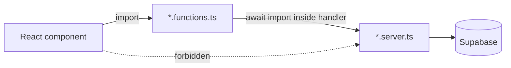

# Contributing Guide

## Purpose

This document defines the engineering standards for the SAKAN codebase: how the
repository is organised, which conventions are mandatory, how changes are
reviewed, and which rules exist because the runtime (TanStack Start on an edge
Worker, Supabase with Row Level Security) will break if they are ignored.

## Table of contents

1. [Toolchain](#1-toolchain)
2. [Repository conventions](#2-repository-conventions)
3. [Coding conventions](#3-coding-conventions)
4. [Client/server boundary rules](#4-clientserver-boundary-rules)
5. [Database changes](#5-database-changes)
6. [Internationalization rules](#6-internationalization-rules)
7. [Design-system rules](#7-design-system-rules)
8. [Git workflow and commits](#8-git-workflow-and-commits)
9. [Pull requests](#9-pull-requests)
10. [Review checklist](#10-review-checklist)
11. [Cross references](#11-cross-references)

---

## 1. Toolchain

| Concern | Tool | Command |
|---|---|---|
| Package manager | Bun (`bunfig.toml`, `bun.lock`) | `bun install` |
| Dev server | Vite 7 | `bun run dev` |
| Production build | Vite + Nitro (Cloudflare Worker target) | `bun run build` |
| Development-mode build | Vite | `bun run build:dev` |
| Lint | ESLint 9 flat config + Prettier plugin | `bun run lint` |
| Format | Prettier | `bun run format` |

Prettier configuration (`.prettierrc`) is authoritative and enforced through
ESLint (`eslint-plugin-prettier/recommended`):

```json
{
  "printWidth": 100,
  "semi": true,
  "singleQuote": false,
  "trailingComma": "all"
}
```

> **Note**
> There is no automated test runner in `package.json`. Verification is manual
> and is described in [TESTING.md](./TESTING.md).

---

## 2. Repository conventions

Directory responsibilities are documented in
[FOLDER_STRUCTURE.md](./FOLDER_STRUCTURE.md). The naming rules below are
load-bearing — the build and the import guards depend on them.

| Pattern | Meaning | Import rules |
|---|---|---|
| `src/routes/**` | File-based routes; `src/routeTree.gen.ts` is generated | Never edit the generated tree |
| `*.functions.ts` | `createServerFn` declarations (RPC surface) | Safe to import from components |
| `*.server.ts` | Server-only implementation helpers | Never imported by components; loaded with `await import()` inside handlers when the module is reachable from a route |
| `queries.ts` | TanStack Query options, keys and client-side Supabase reads | Client-safe |
| `strings.ts` / `*.strings.ts` | Localized string bundles for a feature | Client-safe |
| `types.ts` | Feature-local TypeScript types | Client-safe |

Every `*.functions.ts` file must stay a thin wrapper: module scope contains
only imports, types and exported server-function declarations. Runtime helpers
belong in the paired `*.server.ts` module. Server-function code splitting
removes runtime siblings from the module, which produces a `ReferenceError` at
request time even when the typecheck passes.

---

## 3. Coding conventions

- **TypeScript strict.** No `any` in new code; prefer generated Supabase types
  from `src/integrations/supabase/types.ts`.
- **Comments explain *why*, not *what*.** The existing codebase documents
  non-obvious constraints (for example the empty-body message constraint or the
  offline auth fallback) directly above the code.
- **Components stay small and focused.** Feature UI lives under
  `src/components/<feature>/`; shared shadcn/ui primitives stay in
  `src/components/ui/` and are not forked per feature.
- **Data fetching.** Route loaders call
  `context.queryClient.ensureQueryData(queryOptions)`; components read with
  `useSuspenseQuery`/`useQuery`. Do not fetch in `useEffect`.
- **Mutations.** Use TanStack Query mutations with explicit optimistic
  rollback. Chat mutations in `src/lib/chat/queries.ts` are the reference
  implementation: capture the previous cache entry, patch optimistically, and
  restore it on error.
- **Errors.** Every route with a loader defines `errorComponent`
  (`RouteErrorBoundary` from `src/components/RouteError.tsx`).
- **Environment variables.** `import.meta.env.VITE_*` in browser code;
  `process.env.*` only inside server-function handlers or `*.server.ts`
  modules, never at module scope of a shared file.

---

## 4. Client/server boundary rules



- Never import `@/integrations/supabase/client.server` at module scope of a
  file that a route can reach; load it inside the handler.
- Protected server functions use `requireSupabaseAuth`; they must not be called
  from a public route loader (SSR/prerender has no bearer token).
- Auto-generated integration files must not be edited:
  `src/integrations/supabase/client.ts`, `client.server.ts`,
  `auth-middleware.ts`, `auth-attacher.ts`, `types.ts`, and
  `supabase/config.toml`.

---

## 5. Database changes

1. Write a migration under `supabase/migrations/` — never mutate the database
   out of band.
2. Every `CREATE TABLE` in the `public` schema is followed, in the same
   migration and in this order, by `GRANT` statements, `ENABLE ROW LEVEL
   SECURITY`, then `CREATE POLICY`.
3. Roles are stored only in `public.user_roles` and checked through the
   `SECURITY DEFINER` helpers (`has_role`, `is_staff`, `is_super_admin`).
4. After a schema change, update [DATABASE.md](./DATABASE.md) and
   [DATABASE_SCHEMA.md](./DATABASE_SCHEMA.md) in the same change.

---

## 6. Internationalization rules

- No hardcoded user-facing copy in components. Strings live in
  `src/i18n/locales/{ar,en,de,fr}.ts` or in a feature `strings.ts` bundle
  consumed through `useFeatureStrings`.
- Arabic is the default locale and the layout must remain correct in RTL:
  prefer logical CSS properties and Tailwind logical utilities over
  left/right-specific ones.
- A new string must be added to **all four** locales in the same change. See
  [TRANSLATIONS.md](./TRANSLATIONS.md).

---

## 7. Design-system rules

- Colors, gradients and shadows are semantic tokens defined in
  `src/styles.css`. Hardcoded utilities such as `text-white`, `bg-black` or
  `bg-[#0D1B3D]` are rejected in review.
- Brand constants: Navy `#0D1B3D`, Gold `#D4AF37`, Cairo (Arabic), Montserrat
  (Latin). They are expressed as tokens, not literals in components.
- Animations are wrapped in `motion-safe:` so `prefers-reduced-motion` disables
  them.

---

## 8. Git workflow and commits

- Work on the connected branch in a continuously working state; the branch
  syncs back to the Lovable editor.
- **Never rewrite published history** — no force pushes, rebases, amends or
  squashes of pushed commits.
- Commit messages follow Conventional Commits:

```text
feat(chat): add per-conversation wallpaper override
fix(billing): roll back optimistic plan change when checkout fails
chore(deps): bump @tanstack/react-router
docs(security): document push dispatch token rotation
```

Allowed types: `feat`, `fix`, `perf`, `refactor`, `docs`, `chore`, `style`,
`build`. Scope is the feature folder (`chat`, `billing`, `admin`, `pwa`,
`ai`, `i18n`, `db`).

---

## 9. Pull requests

A pull request description states:

1. **What** changed and **why**.
2. Database migrations included (or "none").
3. New or changed environment variables/secrets (names only, never values).
4. Manual verification performed, per [TESTING.md](./TESTING.md).
5. Screenshots for UI changes, in both RTL (Arabic) and LTR (English).

Keep pull requests scoped to one concern. Schema changes and unrelated UI work
belong in separate pull requests.

---

## 10. Review checklist

- [ ] `bun run lint` passes and the production build succeeds.
- [ ] No server-only module reachable from the client graph.
- [ ] New server functions validate input with Zod and declare middleware.
- [ ] New tables have GRANTs, RLS enabled and policies scoped to `auth.uid()`
      or a role helper.
- [ ] No secret values, keys or tokens committed or logged.
- [ ] All user-facing strings localized in `ar`, `en`, `de`, `fr`.
- [ ] RTL layout verified.
- [ ] Loading, empty, error and offline states handled.
- [ ] Optimistic updates roll back on failure.
- [ ] Affected documents in `docs/` updated.

---

## 11. Cross references

- [ARCHITECTURE.md](./ARCHITECTURE.md)
- [FOLDER_STRUCTURE.md](./FOLDER_STRUCTURE.md)
- [SERVER_FUNCTIONS.md](./SERVER_FUNCTIONS.md)
- [SECURITY.md](./SECURITY.md)
- [TESTING.md](./TESTING.md)
- [TRANSLATIONS.md](./TRANSLATIONS.md)
- [DATABASE.md](./DATABASE.md)