# SAKAN — Database Schema Reference

## Purpose

This document is the entity-relationship reference for the SAKAN Postgres schema (Supabase project). It complements [`DATABASE.md`](./DATABASE.md), which explains *behaviour* (RLS, triggers, functions, storage). Use this document when you need the *shape* of the data: tables, columns, keys, and how tables relate to each other and to `auth.users`.

Source of truth: `src/integrations/supabase/types.ts` (generated from the live schema) cross-checked against `supabase/migrations/*.sql`.

## Table of Contents

- [Entity-Relationship Diagram](#entity-relationship-diagram)
- [Notes on the Diagram](#notes-on-the-diagram)
- [Enum Reference](#enum-reference)
- [Related Documents](#related-documents)

## Entity-Relationship Diagram

```mermaid
erDiagram
    "auth.users" ||--o| profiles : "id = id"
    "auth.users" ||--o{ user_roles : "id = user_id"
    "auth.users" ||--o{ photos : "id = user_id"
    "auth.users" ||--o{ likes : "id = liker_id / liked_id"
    "auth.users" ||--o{ matches : "id = user_low / user_high"
    "auth.users" ||--o{ favorites : "id = user_id / favorite_id"
    "auth.users" ||--o{ blocked_users : "id = blocker_id / blocked_id"
    "auth.users" ||--o{ conversations : "id = user_low / user_high"
    "auth.users" ||--o{ messages : "id = sender_id"
    "auth.users" ||--o{ message_reactions : "id = user_id"
    "auth.users" ||--o{ call_sessions : "id = caller_id / callee_id"
    "auth.users" ||--o{ chat_wallpapers : "id = user_id"
    "auth.users" ||--o{ notifications : "id = user_id / actor_id"
    "auth.users" ||--o{ push_subscriptions : "id = user_id"
    "auth.users" ||--o{ pwa_install_events : "id = user_id"
    "auth.users" ||--o{ verification_requests : "id = user_id / reviewer_id"
    "auth.users" ||--o{ reports : "id = reporter_id / reported_id / reviewer_id"
    "auth.users" ||--o{ moderation_flags : "id = user_id"
    "auth.users" ||--o{ compatibility_scores : "id = user_id / candidate_id"
    "auth.users" ||--o{ saved_searches : "id = user_id"
    "auth.users" ||--o{ subscriptions : "id = user_id"
    "auth.users" ||--o{ payments : "id = user_id"
    "auth.users" ||--o{ billing_customers : "id = user_id"
    "auth.users" ||--o{ billing_events : "id = user_id / actor_id"
    "auth.users" ||--o{ featured_ads : "id = user_id"
    "auth.users" ||--o{ consents : "id = user_id"
    "auth.users" ||--o{ admin_actions : "id = admin_id"
    "auth.users" ||--o{ admin_notes : "id = user_id / author_id"
    "auth.users" ||--o{ activity_logs : "id = user_id"
    "auth.users" ||--o{ user_roles : "id = user_id"

    conversations ||--o{ messages : "id = conversation_id"
    conversations ||--o{ message_reactions : "id = conversation_id"
    conversations ||--o{ call_sessions : "id = conversation_id"
    conversations ||--o{ chat_wallpapers : "id = conversation_id (nullable)"

    messages ||--o{ message_reactions : "id = message_id"
    messages ||--o| messages : "id = reply_to_id (self)"
    messages ||--o{ reports : "id = message_id"

    subscriptions ||--o{ payments : "id = subscription_id"
    subscriptions ||--o{ billing_events : "id = subscription_id"
    payments ||--o{ billing_events : "id = payment_id"
    plans ||--o{ subscriptions : "code = plan_code"

    profiles {
        uuid id PK "FK -> auth.users.id"
        text display_name
        date birth_date
        smallint birth_year
        gender gender
        gender looking_for
        char country_code
        text city
        text bio
        text avatar_url
        text cover_url
        marital_status marital_status
        smallint height_cm
        text education
        text occupation
        religiosity_level religiosity
        language_code preferred_language
        boolean is_verified
        boolean is_active
        boolean is_hidden
        boolean onboarding_complete
        smallint completeness
        avatar_border avatar_border
        profile_theme profile_theme
        presence_status presence_status
        boolean hide_last_seen
        boolean hide_typing
        text[] interests
        text[] spoken_languages
        timestamptz last_seen_at
        timestamptz created_at
        timestamptz updated_at
    }

    user_roles {
        uuid id PK
        uuid user_id FK "-> auth.users.id"
        app_role role
        timestamptz created_at
    }

    photos {
        uuid id PK
        uuid user_id FK "-> auth.users.id"
        photo_kind kind
        text storage_path
        text thumb_path
        integer width
        integer height
        integer byte_size
        text mime_type
        smallint position
        boolean is_primary
        boolean is_approved
        timestamptz created_at
        timestamptz updated_at
    }

    likes {
        uuid id PK
        uuid liker_id FK "-> auth.users.id"
        uuid liked_id FK "-> auth.users.id"
        timestamptz created_at
    }

    matches {
        uuid id PK
        uuid user_low FK "-> auth.users.id"
        uuid user_high FK "-> auth.users.id"
        boolean is_active
        timestamptz matched_at
    }

    favorites {
        uuid id PK
        uuid user_id FK "-> auth.users.id"
        uuid favorite_id FK "-> auth.users.id"
        text note
        timestamptz created_at
    }

    blocked_users {
        uuid id PK
        uuid blocker_id FK "-> auth.users.id"
        uuid blocked_id FK "-> auth.users.id"
        text reason
        timestamptz created_at
    }

    conversations {
        uuid id PK
        uuid user_low FK "-> auth.users.id"
        uuid user_high FK "-> auth.users.id"
        timestamptz last_message_at
        timestamptz created_at
        timestamptz updated_at
    }

    messages {
        uuid id PK
        uuid conversation_id FK "-> conversations.id"
        uuid sender_id FK "-> auth.users.id"
        uuid reply_to_id FK "-> messages.id (nullable)"
        text body
        message_kind kind
        text attachment_path
        text attachment_name
        integer attachment_size
        text attachment_mime
        integer attachment_duration_seconds
        integer attachment_width
        integer attachment_height
        language_code source_language
        jsonb translations
        moderation_verdict moderation
        uuid[] deleted_for
        uuid pinned_by
        timestamptz pinned_at
        timestamptz delivered_at
        timestamptz read_at
        timestamptz edited_at
        timestamptz deleted_at
        timestamptz created_at
    }

    message_reactions {
        uuid id PK
        uuid message_id FK "-> messages.id"
        uuid conversation_id FK "-> conversations.id"
        uuid user_id FK "-> auth.users.id"
        text emoji
        timestamptz created_at
    }

    call_sessions {
        uuid id PK
        uuid conversation_id FK "-> conversations.id"
        uuid caller_id FK "-> auth.users.id"
        uuid callee_id FK "-> auth.users.id"
        text kind "voice | video"
        text status
        text end_reason
        timestamptz started_at
        timestamptz answered_at
        timestamptz ended_at
        timestamptz created_at
        timestamptz updated_at
    }

    chat_wallpapers {
        uuid id PK
        uuid user_id FK "-> auth.users.id"
        uuid conversation_id FK "-> conversations.id (nullable = default wallpaper)"
        text wallpaper_type
        text wallpaper_id
        text custom_image
        numeric blur
        numeric brightness
        numeric opacity
        numeric overlay
        timestamptz created_at
        timestamptz updated_at
    }

    notifications {
        uuid id PK
        uuid user_id FK "-> auth.users.id"
        uuid actor_id FK "-> auth.users.id (nullable)"
        notification_type type
        text title
        text body
        jsonb data
        timestamptz push_sent_at
        timestamptz read_at
        timestamptz archived_at
        timestamptz created_at
    }

    push_subscriptions {
        uuid id PK
        uuid user_id FK "-> auth.users.id"
        text endpoint UK
        text p256dh
        text auth
        text user_agent
        text locale
        timestamptz expiration_time
        integer failure_count
        timestamptz disabled_at
        timestamptz last_used_at
        timestamptz created_at
        timestamptz updated_at
    }

    pwa_install_events {
        uuid id PK
        uuid user_id FK "-> auth.users.id (nullable)"
        text event_type
        text platform
        text user_agent
        text locale
        timestamptz created_at
    }

    verification_requests {
        uuid id PK
        uuid user_id FK "-> auth.users.id"
        uuid reviewer_id FK "-> auth.users.id (nullable)"
        verification_status status
        text document_path
        text selfie_path
        text reviewer_notes
        timestamptz reviewed_at
        timestamptz created_at
        timestamptz updated_at
    }

    reports {
        uuid id PK
        uuid reporter_id FK "-> auth.users.id"
        uuid reported_id FK "-> auth.users.id"
        uuid message_id FK "-> messages.id (nullable)"
        uuid reviewer_id FK "-> auth.users.id (nullable)"
        text reason
        text details
        report_status status
        text reviewer_notes
        timestamptz resolved_at
        timestamptz created_at
        timestamptz updated_at
    }

    moderation_flags {
        uuid id PK
        uuid user_id FK "-> auth.users.id"
        text subject_type
        uuid subject_id
        moderation_verdict verdict
        text[] categories
        numeric score
        text excerpt
        text reason
        timestamptz created_at
    }

    compatibility_scores {
        uuid id PK
        uuid user_id FK "-> auth.users.id"
        uuid candidate_id FK "-> auth.users.id"
        smallint score
        text summary
        text[] strengths
        text[] considerations
        language_code language
        timestamptz created_at
    }

    saved_searches {
        uuid id PK
        uuid user_id FK "-> auth.users.id"
        text label
        jsonb criteria
        timestamptz created_at
    }

    plans {
        text code PK
        smallint tier
        boolean is_public
        char currency
        integer price_monthly_cents
        integer price_annual_cents
        jsonb name
        jsonb tagline
        jsonb features
        jsonb limits
        smallint sort_order
        timestamptz created_at
        timestamptz updated_at
    }

    subscriptions {
        uuid id PK
        uuid user_id FK "-> auth.users.id"
        text plan_code FK "-> plans.code"
        subscription_status status
        billing_interval billing_interval
        text provider
        text provider_ref
        text provider_customer_id
        timestamptz current_period_start
        timestamptz current_period_end
        boolean cancel_at_period_end
        timestamptz trial_end
        timestamptz canceled_at
        timestamptz grace_until
        text previous_plan_code
        text note
        timestamptz started_at
        timestamptz created_at
        timestamptz updated_at
    }

    payments {
        uuid id PK
        uuid user_id FK "-> auth.users.id"
        uuid subscription_id FK "-> subscriptions.id (nullable)"
        integer amount_cents
        char currency
        payment_status status
        text provider
        text provider_ref
        text invoice_number
        text description
        timestamptz period_start
        timestamptz period_end
        timestamptz paid_at
        timestamptz refunded_at
        text failure_reason
        timestamptz created_at
        timestamptz updated_at
    }

    billing_customers {
        uuid id PK
        uuid user_id FK "-> auth.users.id"
        text provider
        text customer_id
        timestamptz created_at
        timestamptz updated_at
    }

    billing_events {
        uuid id PK
        uuid user_id FK "-> auth.users.id"
        uuid subscription_id FK "-> subscriptions.id (nullable)"
        uuid payment_id FK "-> payments.id (nullable)"
        uuid actor_id FK "-> auth.users.id (nullable)"
        billing_event_type type
        text plan_code
        text from_plan_code
        integer amount_cents
        char currency
        jsonb detail
        timestamptz created_at
    }

    featured_ads {
        uuid id PK
        uuid user_id FK "-> auth.users.id"
        text image_path
        text headline
        text subtitle
        text target_url
        featured_ad_status status
        integer amount_cents
        char currency
        text provider
        text provider_ref
        timestamptz paid_at
        timestamptz starts_at
        timestamptz ends_at
        timestamptz display_started_at
        timestamptz paused_at
        integer loops_total
        integer extra_loops
        integer queue_position
        integer impressions
        integer clicks
        text review_note
        timestamptz created_at
        timestamptz updated_at
    }

    ad_placements {
        uuid id PK
        text slot_key UK
        text label
        boolean enabled
        text network
        text unit_id
        integer min_height
        jsonb config
        timestamptz created_at
        timestamptz updated_at
    }

    consents {
        uuid id PK
        uuid user_id FK "-> auth.users.id"
        consent_type consent_type
        boolean granted
        text version
        timestamptz created_at
    }

    admin_actions {
        uuid id PK
        uuid admin_id FK "-> auth.users.id"
        text action
        text target_table
        uuid target_id
        jsonb details
        timestamptz created_at
    }

    admin_notes {
        uuid id PK
        uuid user_id FK "-> auth.users.id"
        uuid author_id FK "-> auth.users.id"
        text note
        timestamptz created_at
        timestamptz updated_at
    }

    activity_logs {
        uuid id PK
        uuid user_id FK "-> auth.users.id (nullable)"
        log_level level
        text event
        jsonb context
        timestamptz created_at
    }

    platform_settings {
        boolean id PK "always true (singleton)"
        text support_email
        boolean maintenance_mode
        language_code default_language
        boolean registration_enabled
        boolean verification_required
        smallint max_gallery_photos
        smallint max_image_mb
        text[] allowed_image_types
        jsonb notify_defaults
        uuid updated_by
        timestamptz created_at
        timestamptz updated_at
    }

    webhook_events {
        text id PK "provider event id"
        text provider
        text event_type
        text status
        jsonb detail
        timestamptz created_at
        timestamptz updated_at
    }
```

## Notes on the Diagram

- `auth.users` is managed by Supabase Auth (`auth` schema) and is not part of `public`. Every table above that references it does so via `ON DELETE CASCADE` (or `SET NULL` for optional reviewer/actor columns), so deleting an auth user cascades through the user's own social graph, chat history, billing history, etc.
- `profiles.id` **is** `auth.users.id` (1:1, no separate surrogate key) — profile rows are created automatically by the `handle_new_user` trigger (see `DATABASE.md`).
- `conversations`, `matches`, and `likes` all use the ordering convention `user_low < user_high` (matches/conversations) so a pair of users is represented by exactly one row regardless of who initiated it. `likes` is directional (`liker_id` → `liked_id`) and is the trigger source for `matches`.
- `messages.reply_to_id` is a self-referencing foreign key (threaded replies).
- `chat_wallpapers.conversation_id` is nullable: a `NULL` value represents the user's global default wallpaper, a non-null value overrides it for one conversation.
- `subscriptions.plan_code` is a foreign key into `plans.code` (not a numeric surrogate id) — plans are addressed by their stable slug (`free`, `premium`, `premium_plus`).
- `billing_events` is an audit trail; it may reference a `subscription_id` and/or `payment_id`, both optional, plus a free-text `plan_code`/`from_plan_code` snapshot so history remains readable even if a plan is later renamed.
- `platform_settings` is a singleton table enforced by `CHECK (id)` on a `boolean` primary key — there is always exactly one row (`id = true`).
- `webhook_events.id` is the **provider's** event id (e.g., a Stripe event id), not a generated UUID, which makes the table naturally idempotent for webhook replay protection.

## Enum Reference

| Enum | Values |
|---|---|
| `app_role` | `user`, `moderator`, `admin`, `super_admin` |
| `avatar_border` | `none`, `gold`, `glow`, `gradient`, `verified` |
| `billing_event_type` | `checkout`, `activated`, `upgraded`, `downgraded`, `canceled`, `resumed`, `renewed`, `payment_succeeded`, `payment_failed`, `grace_started`, `expired`, `refunded` |
| `billing_interval` | `monthly`, `annual` |
| `consent_type` | `terms`, `privacy`, `marketing`, `cookies` |
| `featured_ad_status` | `pending_payment`, `pending_review`, `active`, `expired`, `rejected` |
| `gender` | `male`, `female` |
| `language_code` | `ar`, `en`, `de`, `fr` |
| `log_level` | `debug`, `info`, `warn`, `error` |
| `marital_status` | `single`, `divorced`, `widowed` |
| `message_kind` | `text`, `image`, `file`, `voice` |
| `moderation_verdict` | `pending`, `approved`, `flagged`, `rejected` |
| `notification_type` | `like`, `match`, `message`, `profile_view`, `verification`, `system`, `premium` |
| `payment_status` | `pending`, `succeeded`, `failed`, `refunded` |
| `photo_kind` | `avatar`, `gallery`, `verification` |
| `presence_status` | `online`, `away`, `busy`, `dnd`, `invisible` |
| `profile_theme` | `navy`, `aurora`, `sand`, `emerald`, `rose`, `midnight` |
| `religiosity_level` | `practicing`, `moderate`, `cultural`, `prefer_not_say` |
| `report_status` | `open`, `reviewing`, `resolved`, `dismissed` |
| `subscription_status` | `trialing`, `active`, `past_due`, `canceled`, `expired` |
| `verification_status` | `pending`, `approved`, `rejected`, `expired` |

> **Note:** `language_code` originally included `ru` (Russian); migration `20260803100709` rebuilt the enum, backfilled existing `ru` rows to `fr`, and replaced it with `fr` (French). `message_kind` gained the `voice` value in a later migration for the Telegram-quality chat upgrade. `app_role` gained `super_admin` after launch.

## Related Documents

- [`DATABASE.md`](./DATABASE.md) — table purposes, RLS policies, triggers, functions, storage buckets, and app-code cross-references.
