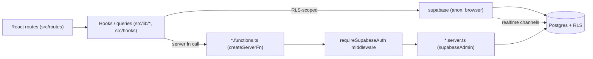

# SAKAN — Feature Reference

## Purpose

This document catalogs every user-facing feature of the SAKAN platform: what it does, how a user moves through it, what it depends on, which database tables back it, what permissions/entitlements gate it, and where the code lives. It is the single source of truth for "what SAKAN does" from a product and engineering perspective.

Sibling docs: [ADMIN.md](./ADMIN.md) (staff console), [TRANSLATIONS.md](./TRANSLATIONS.md) (i18n).

## Table of Contents

1. [Architecture at a glance](#architecture-at-a-glance)
2. [Authentication & Onboarding](#1-authentication--onboarding)
3. [Profiles, Profile Studio & Appearance](#2-profiles-profile-studio--appearance)
4. [Search & Discovery](#3-search--discovery)
5. [Likes, Favorites & Matches](#4-likes-favorites--matches)
6. [Realtime Chat](#5-realtime-chat)
7. [Voice & Video Calls](#6-voice--video-calls)
8. [Presence & Do-Not-Disturb](#7-presence--do-not-disturb)
9. [Notification Center](#8-notification-center)
10. [Push Notifications](#9-push-notifications)
11. [Subscriptions & Billing](#10-subscriptions--billing)
12. [Featured Ads & Ad Slots](#11-featured-ads--ad-slots)
13. [Verification / KYC](#12-verification--kyc)
14. [Reports & Blocking](#13-reports--blocking)
15. [Legal Pages](#14-legal-pages)
16. [PWA & Offline](#15-pwa--offline)
17. [Diagnostics](#16-diagnostics)

---

## Architecture at a glance

SAKAN is a TanStack Start (React) application backed by **Supabase** (Postgres + Auth + Realtime + Storage). Business logic that must run with elevated trust lives in TanStack **server functions** (`*.functions.ts`, executed via `createServerFn`) which call into `*.server.ts` modules using `supabaseAdmin` (service-role client) after validating the caller with `requireSupabaseAuth` middleware. Client code reads/writes via the anon `supabase` client under Row Level Security (RLS) for anything that doesn't need elevated privilege.

Routing conventions used below:
- `src/routes/_authenticated/*` — signed-in app shell routes.
- `src/routes/admin/*` — staff console (see ADMIN.md).
- `src/routes/api/*` — HTTP endpoints (webhooks, public feeds).

---

## 1. Authentication & Onboarding

**Purpose:** Let visitors create an account, sign in, and complete the mandatory profile-completion flow before accessing the app.

**User flow:**
1. Visitor opens `/auth` (or is redirected there by a protected route's `beforeLoad`) and signs up/in via Supabase Auth (email/password).
2. On first login, `_authenticated/route.tsx` checks profile completeness and routes incomplete accounts to `/onboarding`.
3. `_authenticated/onboarding.tsx` walks the user through required fields (gender, birth date, country, looking-for, bio, photos) before unlocking the rest of the app.
4. Session persistence and offline resilience are handled by `src/lib/auth/offline-session.ts`, which caches the last known session so the shell can render while connectivity is restored.

**Dependencies:** Supabase Auth (GoTrue), `useAuth()` hook (`src/hooks/useAuth.tsx`) for session/user state, `supabase` client (`src/integrations/supabase/client.ts`).

**Database tables:** `auth.users` (Supabase-managed), `public.profiles` (1:1 extension row created on signup), `public.consents` (GDPR consent capture), `public.user_roles` (default `user` role).

**Permissions/entitlements:** None beyond an authenticated session; onboarding completion is enforced client-side via route guards and server-side via `profiles` completeness checks used elsewhere (e.g., discovery excludes incomplete profiles).

**Routes:** `/auth`, `/onboarding` (`src/routes/_authenticated/onboarding.tsx`), `_authenticated/route.tsx` (guard).

**Source files:** `src/hooks/useAuth.tsx`, `src/lib/auth/offline-session.ts`, `src/routes/_authenticated/route.tsx`, `src/routes/_authenticated/onboarding.tsx`.

---

## 2. Profiles, Profile Studio & Appearance

**Purpose:** Let members build and maintain the profile that drives discovery and matching, and customize how their profile card/theme appears to others.

**User flow:**
1. `/profile` shows the member's own profile as others see it.
2. `/profile/edit` (Profile Studio) exposes structured editing of bio, attributes, gallery photos, and preferences, backed by `src/lib/profile-queries.ts`-style mutations.
3. `/profile/appearance` (`profile.appearance.tsx`) lets the member pick card themes/visual presentation, backed by `src/lib/profile/appearance.ts`.
4. Preferred language chosen here (or via the language switcher) is persisted to `profiles.preferred_language` and restored on next login by `LocaleSync` (see TRANSLATIONS.md).

**Dependencies:** Supabase Storage (photo uploads), `is_verified`/`is_active`/`is_hidden` flags that affect visibility, `useI18n` for locale persistence.

**Database tables:** `public.profiles`, `public.photos` (`photo_kind`: `avatar` | `gallery` | `verification`).

**Permissions/entitlements:** A user may only edit their own profile (RLS `auth.uid() = id`). Certain appearance options may be gated behind an active subscription plan (see [Subscriptions](#10-subscriptions--billing)).

**Routes:** `/profile`, `/profile/edit`, `/profile/appearance`.

**Source files:** `src/routes/_authenticated/profile.tsx`, `src/routes/_authenticated/profile.edit.tsx`, `src/routes/_authenticated/profile.appearance.tsx`, `src/lib/profile/appearance.ts`, `src/lib/profile/strings.ts`.

---

## 3. Search & Discovery

**Purpose:** Help members find compatible profiles through browsing, filtered search, and saved search alerts.

**User flow:**
1. `/discover` presents a filterable, virtualized feed of active/verified profiles (gender, age range, country, etc.).
2. Members can save a filter combination via the `SavedSearchBar` component; saved searches are persisted and can be re-run or (where implemented) surfaced again later.
3. Recent search terms/filters are cached client-side via `src/lib/search-history.ts` for quick recall.
4. Large result sets are rendered with list virtualization to keep scroll performance smooth as the candidate pool grows.

**Dependencies:** `profiles` visibility rules (`is_active`, `is_hidden`, `is_verified`), blocking list (excludes blocked/blocking users — see [Reports & Blocking](#13-reports--blocking)), presence data for "online now" badges.

**Database tables:** `public.profiles`, `public.blocks` (exclusion), saved-search state (client-persisted; see `src/lib/search-history.ts` and `src/components/search/SavedSearchBar.tsx` for the current storage strategy — note: saved searches are implemented at the UI/local-storage layer rather than a dedicated server table unless a `saved_searches` table is present in later migrations).

**Permissions/entitlements:** Requires an authenticated, onboarded account. Some advanced filters or unlimited daily browsing may be entitlements of paid plans (see Subscriptions).

**Routes:** `/discover`.

**Source files:** `src/routes/_authenticated/discover.tsx`, `src/components/search/SavedSearchBar.tsx`, `src/lib/search-history.ts`, `src/lib/members.ts`.

---

## 4. Likes, Favorites & Matches

**Purpose:** Let members express interest (like/favorite) and surface reciprocated interest as a match, which unlocks messaging.

**User flow:**
1. From a profile card or detail view, a member can "like" or "favorite" another profile.
2. `/favorites` lists profiles the member has favorited.
3. When two members like each other, a match is created and surfaced on `/matches`; matches typically unlock a conversation thread.
4. Social realtime events (new like, new match) are pushed live via Supabase Realtime channels.

**Dependencies:** Realtime channels (`src/lib/social/realtime.ts`), notification generation (a match/like triggers a `public.notifications` row), chat creation on match.

**Database tables:** `public.matches`, `public.notifications` (`notification_type`: `like` | `match` | ...), and a likes/favorites table exposed through `src/lib/social/queries.ts`.

**Permissions/entitlements:** Requires authentication; RLS restricts read/write to rows where the caller is a participant. Daily like limits or "see who liked you" may be premium entitlements.

**Routes:** `/favorites`, `/matches`.

**Source files:** `src/routes/_authenticated/favorites.tsx`, `src/routes/_authenticated/matches.tsx`, `src/lib/social/queries.ts`, `src/lib/social/keys.ts`, `src/lib/social/realtime.ts`, `src/lib/social/strings.ts`, `src/components/social/*`.

---

## 5. Realtime Chat

**Purpose:** Telegram-quality one-to-one messaging between matched members, including rich message interactions.

**User flow:**
1. `/messages` lists conversations; `/messages/:id` opens a thread.
2. Members send text/attachments; messages appear live via Supabase Realtime subscriptions (`src/lib/chat/realtime.ts`).
3. Rich interactions: emoji **reactions** (`src/lib/chat/reactions.ts`), **pinning** messages, **editing** and **deleting** sent messages, **forwarding** a message to another conversation, and **attachments** (images/files) uploaded to Supabase Storage.
4. Members can personalize a conversation's **wallpaper** (`src/lib/chat/wallpapers.ts`, `wallpaper-queries.ts`), stored per-conversation or per-user.

**Dependencies:** Supabase Realtime (Postgres changes / broadcast channels), Supabase Storage for attachments, presence for typing/online indicators, push notifications for offline delivery.

**Database tables:** `public.conversations`, `public.messages`, message reaction/pin/wallpaper tables surfaced through `src/lib/chat/queries.ts`, `reactions.ts`, and `wallpaper-queries.ts`.

**Permissions/entitlements:** Only conversation participants can read/write (RLS). Some features (e.g., attachment size/type, message retention) may be shaped by the `platform_settings` (`max_image_mb`, `allowed_image_types`) an admin controls; unlimited messaging may be a subscription entitlement.

**Routes:** `/messages`, `/messages/:id`.

**Source files:** `src/routes/_authenticated/messages.index.tsx`, `src/routes/_authenticated/messages.$id.tsx`, `src/lib/chat/queries.ts`, `src/lib/chat/realtime.ts`, `src/lib/chat/reactions.ts`, `src/lib/chat/types.ts`, `src/lib/chat/wallpapers.ts`, `src/lib/chat/wallpaper-queries.ts`, `src/lib/chat/wallpaper-strings.ts`, `src/lib/chat/strings.ts`, `src/components/chat/*`.

---

## 6. Voice & Video Calls

**Purpose:** In-app voice/video calling between matched members.

**User flow:**
1. A call is initiated from a conversation; `CallProvider` (`src/lib/calls/CallProvider.tsx`) manages call state (ringing, connecting, connected, ended) across the app shell so a call can persist while navigating.
2. Server-side signaling/session setup is handled by `src/lib/calls/calls.functions.ts` (server fn entry points) calling `src/lib/calls/calls.server.ts`.
3. Ringtones and call-state audio cues come from `src/lib/calls/tones.ts` and the shared `src/lib/audio/engine.ts`.
4. `src/components/calls/*` renders the in-call UI (controls, incoming call sheet, etc.).

**Dependencies:** WebRTC (peer connection) with Supabase used as the signaling channel; `CallProvider` context; audio engine for tones.

**Database tables:** A calls/call-sessions table used by `calls.server.ts` to track call state and history (see `src/lib/calls/types.ts` for the shape).

**Permissions/entitlements:** Only available between matched members; call minutes or video (vs. voice-only) may be gated by subscription plan.

**Routes:** Surfaced as an overlay from the messaging UI rather than a dedicated route.

**Source files:** `src/lib/calls/CallProvider.tsx`, `src/lib/calls/calls.functions.ts`, `src/lib/calls/calls.server.ts`, `src/lib/calls/types.ts`, `src/lib/calls/tones.ts`, `src/lib/calls/strings.ts`, `src/components/calls/*`, `src/lib/audio/engine.ts`.

---

## 7. Presence & Do-Not-Disturb

**Purpose:** Show accurate online/away/offline status and let members suppress presence broadcasting or notifications when they don't want to be disturbed.

**User flow:**
1. `usePresence()` (`src/hooks/usePresence.ts`) tracks and broadcasts the current user's presence and subscribes to others'.
2. `useIsOnline(userId, lastSeenAt)` and `useIsAway(userId)` derive a display status (online/away/offline) for profile cards, chat headers, and call eligibility.
3. `formatLastSeen(...)` renders a human-readable "last seen" string when a user is offline.
4. `useMyPresenceStatus()` exposes the current user's own status, including a Do-Not-Disturb toggle that changes how presence/notifications are broadcast.
5. Visual presence indicators are rendered by `src/components/presence/*`.

**Dependencies:** Supabase Realtime presence channels; `profiles.last_seen_at` as a fallback/ persistence layer.

**Database tables:** `public.profiles` (`last_seen_at`), plus realtime presence state (in-memory/channel, not persisted as a table).

**Permissions/entitlements:** Presence visibility follows the same block/visibility rules as discovery — blocked users never see each other's presence.

**Routes:** Cross-cutting (rendered inside profile cards, chat, and matches views).

**Source files:** `src/hooks/usePresence.ts`, `src/components/presence/*`.

---

## 8. Notification Center

**Purpose:** In-app inbox for likes, matches, messages, profile views, verification updates, and system announcements.

**User flow:**
1. `/notifications` lists notifications for the signed-in user, most-recent first, with read/unread state.
2. `useNotifications()` (`src/hooks/useNotifications.ts`) subscribes to new notification rows in realtime and updates unread badges across the shell.
3. Notification sounds are played via `src/lib/notifications/sounds.ts` when a new item arrives while the app is foregrounded.
4. Shared shaping/formatting logic for notification payloads lives in `src/lib/notifications/shared.ts`.

**Dependencies:** Supabase Realtime, push notifications (for backgrounded/offline delivery), admin broadcast tool (see ADMIN.md) which writes into the same table.

**Database tables:** `public.notifications` (`notification_type`: `like`, `match`, `message`, `profile_view`, `verification`, `system`).

**Permissions/entitlements:** A user can only read their own notifications (RLS `user_id = auth.uid()`).

**Routes:** `/notifications`.

**Source files:** `src/routes/_authenticated/notifications.tsx`, `src/hooks/useNotifications.ts`, `src/lib/notifications/shared.ts`, `src/lib/notifications/sounds.ts`, `src/components/notifications/*`.

---

## 9. Push Notifications

**Purpose:** Deliver key events (new message, match, like) to members even when SAKAN isn't open, via Web Push.

**User flow:**
1. The client requests notification permission and registers a Web Push subscription (`src/lib/push/push-browser.ts`), storing the subscription server-side.
2. Server-side sending is implemented with the Web Push protocol in `src/lib/push/webpush.server.ts`, triggered by the relevant event (new message, match, admin broadcast) via `src/lib/push/push.functions.ts` server functions.
3. Notifications are delivered by the browser/OS push service and, when clicked, deep-link back into the relevant SAKAN screen.

**Dependencies:** Service worker (see [PWA & Offline](#15-pwa--offline)), VAPID keys/Web Push credentials, `notification_type` categorization for per-type opt-outs.

**Database tables:** A push-subscriptions table (endpoint, keys, user_id) consumed by `webpush.server.ts`; notification preferences may live on `public.profiles` or a dedicated preferences table (`notify_defaults` platform setting provides system-wide defaults, see ADMIN.md).

**Permissions/entitlements:** Requires browser permission grant; a member can only manage their own subscriptions.

**Routes:** No dedicated route; registration happens from the app shell/settings and the service worker.

**Source files:** `src/lib/push/push-browser.ts`, `src/lib/push/push.functions.ts`, `src/lib/push/webpush.server.ts`.

---

## 10. Subscriptions & Billing

**Purpose:** Monetize SAKAN via paid plans (e.g., unlocking premium discovery/chat/call features) with a provider-agnostic billing layer.

**User flow:**
1. `/billing` shows the member's current plan, usage, and available plans, and lets them subscribe/upgrade/cancel.
2. `src/lib/billing/queries.ts` reads plan/subscription state; `src/lib/billing/billing.functions.ts` exposes server actions (checkout, cancel, change plan) that call `billing.server.ts`.
3. Payment processing is abstracted behind `provider.server.ts`, with a concrete Stripe implementation in `stripe.server.ts` and inbound events handled by `webhook.server.ts` (e.g., `src/routes/api/*` webhook endpoint).
4. `customers.server.ts` maps SAKAN users to billing-provider customer records.

**Dependencies:** Stripe (or another provider behind the same interface), webhook endpoint under `src/routes/api`, admin billing tools (ADMIN.md) for support actions.

**Database tables:** `public.plans` (`code`, `price_monthly_cents`, `price_annual_cents`), `public.subscriptions` (`status`: `trialing` | `active` | `past_due` | `canceled` | `expired`, `plan_code`, `billing_interval`), `public.payments` (`amount_cents`, `status`, `paid_at`, `refunded_at`).

**Permissions/entitlements:** A user manages only their own subscription (RLS). Feature flags elsewhere in the app (extra likes, video calls, ad boosting, appearance themes) read the active plan/entitlement to unlock behavior.

**Routes:** `/billing`.

**Source files:** `src/routes/_authenticated/billing.tsx`, `src/lib/billing/billing.functions.ts`, `src/lib/billing/billing.server.ts`, `src/lib/billing/provider.server.ts`, `src/lib/billing/stripe.server.ts`, `src/lib/billing/webhook.server.ts`, `src/lib/billing/customers.server.ts`, `src/lib/billing/queries.ts`, `src/lib/billing/types.ts`, `src/lib/billing/strings.ts`, `src/components/billing/*`.

---

## 11. Featured Ads & Ad Slots

**Purpose:** Let members (or the platform) promote a profile into high-visibility "featured" slots to increase exposure.

**User flow:**
1. `/featured` lets a member purchase/activate a featured placement for their profile (often tied to a subscription entitlement or one-off purchase).
2. Active featured profiles are surfaced in dedicated ad slots on discovery/home screens.
3. `src/lib/ads/ads.functions.ts` exposes server actions to create/renew/cancel a featured placement; `ads.server.ts` implements the logic and slot allocation; `queries.ts` reads current/active ads for display.

**Dependencies:** Billing (featured ads may be purchased), discovery feed (ad slots interleaved with organic results).

**Database tables:** An ads/featured-placements table (slot, `starts_at`/`ends_at`, `user_id`, status) consumed by `src/lib/ads/ads.server.ts` and `queries.ts`.

**Permissions/entitlements:** A member can only manage their own ad; the number/duration of concurrent featured slots may be limited by plan.

**Routes:** `/featured`.

**Source files:** `src/routes/_authenticated/featured.tsx`, `src/lib/ads/ads.functions.ts`, `src/lib/ads/ads.server.ts`, `src/lib/ads/queries.ts`, `src/lib/ads/types.ts`, `src/lib/ads/strings.ts`, `src/components/ads/*`.

---

## 12. Verification / KYC

**Purpose:** Confirm a member's identity/photo authenticity to reduce fake profiles and unlock a "verified" badge that increases trust and discovery ranking.

**User flow:**
1. From profile settings, a member submits a verification request (typically a selfie/ID photo uploaded as a `verification` photo kind).
2. The request is queued for staff review (see ADMIN.md → Verifications) with status `pending`.
3. Staff approve or reject the request; on approval, `profiles.is_verified` is set and a `verification` notification is sent to the member.

**Dependencies:** Supabase Storage (verification photo upload), admin verification queue and `decideVerification`/`reviewVerification` server actions (ADMIN.md), notifications.

**Database tables:** `public.verification_requests` (`status`: `pending` | `approved` | `rejected` | `expired`), `public.photos` (`photo_kind = 'verification'`), `public.profiles.is_verified`.

**Permissions/entitlements:** A member can submit/view only their own verification request; only staff can approve/reject (see ADMIN.md).

**Routes:** Verification submission is embedded in profile/settings flows rather than a standalone route; review happens at `/admin/verifications`.

**Source files:** Profile settings components under `src/components/profile/*`; staff-side logic in `src/lib/admin/admin.server.ts` (`listVerifications`, `reviewVerification`, `bulkReviewVerifications`) and `src/lib/admin/ops.server.ts` (`listVerificationQueue`, `decideVerification`).

---

## 13. Reports & Blocking

**Purpose:** Give members tools to report abusive behavior/content and to block another user from contacting or seeing them.

**User flow:**
1. From a profile or conversation, a member can **report** another user (choosing a reason, optional details); this creates a `reports` row with status `open`.
2. A member can **block** another user; blocking hides both users from each other in discovery, chat, and presence, and prevents new messages.
3. Staff triage reports at `/admin/reports` (see ADMIN.md), resolving or dismissing them and optionally taking action against the reported account.

**Dependencies:** Discovery/search exclusion logic, chat send-guard (blocked users cannot message each other), moderation flags for AI-assisted content moderation (`src/lib/ai/moderation.functions.ts`, `moderation-helpers.server.ts`).

**Database tables:** `public.reports` (`status`: `open` | `reviewing` | `resolved` | `dismissed`, `reporter_id`, `reported_id`, `reason`), `public.blocks` (`blocker_id`, `blocked_id`), `public.moderation_flags`/AI moderation verdicts (`moderation_verdict`: `pending` | `approved` | `flagged` | `rejected`).

**Permissions/entitlements:** A member may only create reports/blocks involving themselves as the actor; RLS prevents reading others' reports. Reviewing/resolving reports requires staff role.

**Routes:** Report/block actions are embedded in profile and chat UI; staff review at `/admin/reports`.

**Source files:** `src/components/social/*`, `src/components/chat/*` (block/report entry points), `src/lib/ai/moderation.functions.ts`, `src/lib/ai/moderation-helpers.server.ts`, staff-side: `src/lib/admin/admin.server.ts` (`listReports`, `resolveReport`, `bulkResolveReports`, `listModerationFlags`, `resolveModerationFlag`), `src/lib/admin/ops.server.ts` (`listReportsFull`, `actOnReport`).

---

## 14. Legal Pages

**Purpose:** Publish the platform's legal/compliance content: About, Terms, Privacy Policy, Impressum, and the marriage-law guide referenced in navigation.

**User flow:** Visitors and members reach these from the footer/nav (`nav.about`, `nav.guide`, etc.) and read static, localized legal content.

**Dependencies:** i18n dictionaries provide the navigation labels; content itself is authored per-locale in the `src/lib/legal/*` modules.

**Database tables:** None — legal content is static/code-defined, not stored in the database.

**Permissions/entitlements:** Publicly accessible, no authentication required.

**Routes:** Public marketing/legal routes (About, Terms, Privacy, Impressum, Guide) rendered from the corresponding content modules.

**Source files:** `src/lib/legal/about.ts`, `src/lib/legal/terms.ts`, `src/lib/legal/privacy.ts`, `src/lib/legal/impressum.ts`, `src/lib/legal/guide.ts`, `src/lib/legal/types.ts`, `src/components/legal/*`.

---

## 15. PWA & Offline

**Purpose:** Let SAKAN be installed as a Progressive Web App and remain usable (or gracefully degrade) without a network connection.

**User flow:**
1. The service worker is registered on app start via `src/lib/pwa/register.ts`.
2. An install prompt/badge is surfaced using `src/lib/pwa/badge.ts`; `src/components/pwa/*` renders install prompts and offline banners, with copy defined in `src/components/pwa/pwa.strings.ts`.
3. If the network drops, `src/lib/auth/offline-session.ts` keeps the last-known session hydrated so the shell can render a meaningful offline state rather than a blank screen.
4. PWA usage/engagement is measured via `src/lib/pwa/analytics.functions.ts` (server function reporting install/usage events).

**Dependencies:** Browser service worker APIs, Web App Manifest, push notifications (share the same service worker).

**Database tables:** PWA analytics events are persisted via `analytics.functions.ts` into an analytics/events table (see also `getAnalytics` admin surface for aggregate reporting, ADMIN.md).

**Permissions/entitlements:** None — available to any visitor; installability depends on browser/platform support.

**Routes:** Cross-cutting (manifest + service worker apply to the whole app, not a single route).

**Source files:** `src/lib/pwa/register.ts`, `src/lib/pwa/badge.ts`, `src/lib/pwa/analytics.functions.ts`, `src/components/pwa/pwa.strings.ts`, `src/components/pwa/*`, `src/lib/auth/offline-session.ts`.

---

## 16. Diagnostics

**Purpose:** Give members (and support staff, when screen-sharing) a self-service page to check connectivity, permissions, and client environment health when something isn't working (e.g., calls, push, realtime).

**User flow:** The member opens `/diagnostics` to see status checks (e.g., auth session, realtime connectivity, push subscription state, service worker status) useful for troubleshooting support tickets.

**Dependencies:** Reuses the same hooks/clients as the features it inspects (`useAuth`, `usePresence`, push registration, Supabase Realtime connection state).

**Database tables:** None dedicated — it reads live client/service state rather than persisted data.

**Permissions/entitlements:** Requires authentication (it lives under `_authenticated`).

**Routes:** `/diagnostics`.

**Source files:** `src/routes/_authenticated/diagnostics.tsx`.

---

## Notes & Warnings

- This document reflects the code as read in `src/routes`, `src/lib`, and `supabase/migrations` at the time of writing. Table names not directly confirmed by a migration grep (e.g., saved searches, push subscriptions, ads slots, calls sessions) are described based on the corresponding `*.server.ts`/`queries.ts` module's usage; consult `src/integrations/supabase/types.ts` for the authoritative generated schema before relying on exact column names.
- Feature entitlement gating (which plan unlocks which feature) is enforced primarily in the `*.server.ts` / `*.functions.ts` modules per feature; there is no single central entitlements table documented here — trace `useSubscription()` (`src/hooks/useSubscription.ts`) and each feature's server module for the exact rules.
