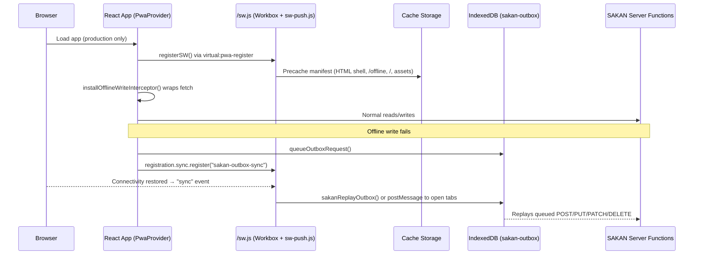
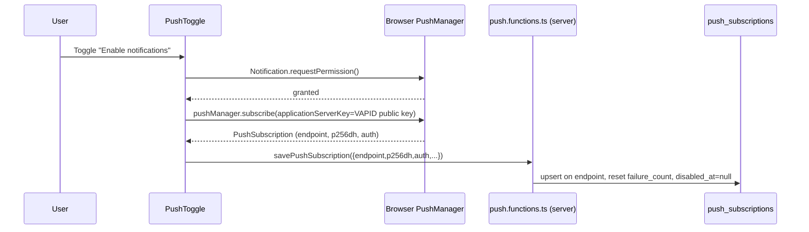

# PWA — Offline, Installability & Push

## Purpose

SAKAN ships as an installable Progressive Web App with an offline shell, Web
Push notifications, background write replay ("outbox"), an app icon badge and
a controlled update flow. This document describes every moving part: the
Workbox-generated service worker, the hand-written extensions layered on top
of it, the client registrar, and the React components that surface install,
update and push UI.

It documents only what is implemented in this repository — no speculative or
planned features.

## Table of Contents

1. [Architecture Overview](#architecture-overview)
2. [Web App Manifest](#web-app-manifest)
3. [Service Worker Composition](#service-worker-composition)
4. [Precaching](#precaching)
5. [Runtime Caching Strategies](#runtime-caching-strategies)
6. [Offline Behaviour & the Offline Route](#offline-behaviour--the-offline-route)
7. [Registration & Environment Gating](#registration--environment-gating)
8. [Update Flow & Versioning](#update-flow--versioning)
9. [Install Prompt](#install-prompt)
10. [Push Subscription Lifecycle](#push-subscription-lifecycle)
11. [Push Delivery (Server Side)](#push-delivery-server-side)
12. [Notification Click & Subscription Rotation](#notification-click--subscription-rotation)
13. [Background Sync & Outbox Replay](#background-sync--outbox-replay)
14. [Badge API](#badge-api)
15. [Failure Recovery](#failure-recovery)
16. [Troubleshooting](#troubleshooting)
17. [Related Documents](#related-documents)

## Architecture Overview



The service worker file served at `/sw.js` is a single artifact composed of
two sources:

| Layer | Owner | Responsibility |
|---|---|---|
| Workbox (`generateSW`) | `vite-plugin-pwa`, configured in `vite.config.ts` | Precaching, cache versioning, cleanup of outdated caches, `navigationPreload`, `runtimeCaching` routes |
| `public/sw-push.js` | Hand-written, pulled in via `importScripts` | Web Push (`push`, `notificationclick`, `pushsubscriptionchange`), Background Sync, Periodic Background Sync |

`sw-push.js` registers no `fetch` listener, so it can never intercept a
request that Workbox would otherwise route — there is exactly one worker with
one clear ownership split.

## Web App Manifest

`public/manifest.webmanifest` is the **authoritative** manifest — `VitePWA`
is configured with `manifest: false` specifically so this static file (with
its shortcuts and screenshots) is served as-is instead of being generated.

Key fields:

| Field | Value | Notes |
|---|---|---|
| `id` / `start_url` | `/` / `/?source=pwa` | The query param lets analytics distinguish installed-app launches |
| `display` / `display_override` | `standalone` / `["standalone","minimal-ui","browser"]` | Falls back gracefully on browsers without full standalone support |
| `lang` / `dir` | `ar` / `rtl` | The app is Arabic-first |
| `background_color` / `theme_color` | `#0D1B3D` | SAKAN navy, used for the splash screen and browser chrome |
| `icons` | 192/512 px `any` + `maskable` variants, plus a 180×180 `apple-touch-icon` | Covers Android adaptive icons and iOS |
| `screenshots` | 4 entries (`narrow`/`wide` form factors) | Powers the richer install UI on supporting browsers |
| `shortcuts` | Search, Messages, Notifications | Long-press/jump-list entries on the home screen icon |

## Service Worker Composition

`vite.config.ts` configures `VitePWA` with:

- `strategies: "generateSW"` — Workbox generates the worker; SAKAN does not
  hand-roll `fetch` routing.
- `registerType: "autoUpdate"` — a new worker activates itself (`skipWaiting`
  + `clientsClaim`) without waiting for all tabs to close; the app instead
  shows a reload banner (see [Update Flow](#update-flow--versioning)).
- `injectRegister: null` — the plugin does not inject its own registration
  script; `src/lib/pwa/register.ts` is the single registrar.
- `filename: "sw.js"`, `outDir: "dist/client"` — matches the Nitro/TanStack
  Start build output so the worker and its precache manifest URLs resolve
  correctly under SSR.
- `workbox.importScripts: ["/sw-push.js"]` — stitches in the hand-written
  extensions at the top of the generated worker.

## Precaching

```ts
globPatterns: ["**/*.{js,css,html,ico,png,svg,webp,woff2,webmanifest}"]
additionalManifestEntries: [
  { url: "/offline", revision: `${Date.now()}` },
  { url: "/", revision: `${Date.now()}` },
]
cleanupOutdatedCaches: true
clientsClaim: true
skipWaiting: true
navigateFallback: null
maximumFileSizeToCacheInBytes: 5 * 1024 * 1024
navigationPreload: true
```

Because the app is server-rendered (TanStack Start / Nitro), there is no
static HTML on disk for Workbox to discover through `globPatterns`. The two
`additionalManifestEntries` explicitly fetch and precache `/offline` and `/`
at install time so a **cold, offline first launch** still has something to
render. Their revision is `Date.now()` at build time, so every deploy forces
Workbox to refetch and replace them.

`navigateFallback: null` is deliberate: SAKAN does not use a generic SPA
fallback shell. Navigations are handled entirely by the `NetworkFirst`
runtime-caching rule below, whose own `handlerDidError` plugin supplies the
offline document.

## Runtime Caching Strategies

Configured under `workbox.runtimeCaching` in `vite.config.ts`, evaluated in
order:

| # | Matches | Strategy | Cache name | Expiration | Notes |
|---|---|---|---|---|---|
| 1 | `request.mode === "navigate"` (HTML page loads) | `NetworkFirst` | `sakan-pages` | 40 entries / 7 days | `networkTimeoutSeconds: 8`; only `200` responses are cached. A `handlerDidError` plugin serves `/offline.html` (falling back to the cached `/`) when the network fails and nothing better is cached. |
| 2 | `request.destination === "image"` | `CacheFirst` | `sakan-images` | 150 entries / 30 days | Covers same-origin and cross-origin image requests (app icons, illustrations). |
| 3 | `https://fonts.googleapis.com/*` | `StaleWhileRevalidate` | `sakan-font-css` | — | Font stylesheet CSS; revalidated on every use. |
| 4 | `https://fonts.gstatic.com/*` | `CacheFirst` | `sakan-fonts` | 30 entries / 365 days | Font binaries — effectively immutable. |
| 5 | `https://*.supabase.co/storage/v1/object/*` | `StaleWhileRevalidate` | `sakan-remote-media` | 120 entries / 14 days | Avatars, gallery photos, wallpapers served from Supabase Storage. |

**Warning:** rule 1's `cacheableResponse` only allows status `200` — a
network response with any other status (e.g. a 401 redirect page) is not
cached, so the next offline visit to that route falls through to
`handlerDidError`.

## Offline Behaviour & the Offline Route

`public/offline.html` is a static, dependency-free, self-hydrating HTML
document (no JS framework, no router) — it is designed to render correctly
even on a cold start with zero cached JS. It:

- Displays a bilingual (Arabic/English) "no connection" message with the
  SAKAN navy/gold theme.
- Provides a "Retry" button that calls `location.reload()`.
- Links back to `/` for a full app restart once connectivity returns.
- Declares its own `<link rel="manifest">` and icons so it is still
  installable/brandable in isolation.

It is served whenever the navigation `NetworkFirst` rule's network attempt
fails and no better cached document exists (see rule 1 above). Note there
are **two** related URLs precached: `/offline` (an app route, rendered by the
React app for in-app soft-offline states) and `/offline.html` (the static
document served by the service worker for a hard offline failure). The
service worker only ever serves the static `/offline.html`.

## Registration & Environment Gating

`src/lib/pwa/register.ts` is the **only** place allowed to call
`serviceWorker.register`. `serviceWorkerAllowed()` refuses to install a
worker when any of the following is true:

- Running outside a browser (SSR) or `serviceWorker` is unsupported.
- Not a production build (`import.meta.env.PROD` is false) — no service
  worker in local dev.
- The page is embedded in an iframe (`window.self !== window.top`) — avoids
  the Lovable editor preview picking up a worker.
- The hostname is a known preview/editor host (`id-preview--*`,
  `preview--*`, `lovableproject.com`, `lovableproject-dev.com`,
  `beta.lovable.dev` and their subdomains).
- The URL has `?sw=off` — an explicit escape hatch for support/debugging.

When disallowed, `unregisterAppWorker()` removes any previously installed
worker for the origin **and** deletes every cache whose key starts with
`sakan-` or `workbox-`, so a stale cache can never strand a preview session.

`startServiceWorker()` (called once from `PwaProvider`) wires:

- `registerSW({ immediate: true, ... })` from `virtual:pwa-register`.
- `onRegisteredSW`: registers Background/Periodic Sync tags
  (`registerSyncTags`) and starts an hourly `registration.update()` poll for
  long-lived sessions.
- `onOfflineReady`: dispatches `sakan:offline-ready` (currently unused by any
  UI component beyond being available as an event).
- A `controllerchange` listener on `navigator.serviceWorker`: the **first**
  controller change (initial install) is ignored; any subsequent one (a new
  worker took over) dispatches `sakan:update-ready`, which `UpdateBanner`
  listens for.

## Update Flow & Versioning

Because `registerType: "autoUpdate"` combines with `skipWaiting` +
`clientsClaim` in the Workbox config, a newly deployed worker activates and
claims all clients **without waiting** for tabs to close. The already-open
page, however, is still running the old JavaScript bundle, so:

1. The new worker activates → `controllerchange` fires in every open tab.
2. `register.ts` dispatches `sakan:update-ready` (skipping the very first,
   initial-install controller change).
3. `UpdateBanner` (`src/components/pwa/UpdateBanner.tsx`) becomes visible and
   shows a "reload" call to action.
4. Clicking it calls `applyUpdate()`, which is a plain `window.location.reload()`
   — the reload loads the already-active worker's assets.

`APP_VERSION` (`import.meta.env.VITE_APP_VERSION`, default `"1.0.0"`) is
exported from `register.ts` and rendered by `VersionIndicator`
(`src/components/pwa/PushToggle.tsx`) in Settings, so support staff can ask a
member which build they are running.

## Install Prompt

`PwaProvider` captures the `beforeinstallprompt` event globally:

- `event.preventDefault()` defers the native prompt.
- The event is cached in a module-level variable (`deferredInstallPrompt`)
  and a `sakan:install-available` custom event is dispatched.
- `appinstalled` clears the cached prompt and dispatches
  `sakan:app-installed`.
- Both events call `recordInstallEvent` (`src/lib/pwa/analytics.functions.ts`)
  for unauthenticated funnel analytics (`pwa_install_events` table), rate
  limited server-side to 600 events/minute per event type and never allowed
  to throw back into the install flow.

`InstallPrompt` (`src/components/pwa/InstallPrompt.tsx`):

- Stays hidden if the app is already installed (`isAppInstalled()` — checks
  `display-mode: standalone`/`window-controls-overlay` media queries or
  `navigator.standalone` on iOS) or if the member dismissed it within the
  last 7 days (`localStorage["sakan-install-dismissed"]`, TTL
  `DISMISS_TTL_MS`).
- On Android/desktop Chromium it shows immediately if a deferred prompt is
  available and calls `prompt()` + awaits `userChoice` on tap, logging
  `accepted`/`dismissed`.
- On iOS (`isIos()`, no `beforeinstallprompt` support) it shows itself after
  a 2.5 s delay and, on tap, swaps to a static "Add to Home Screen"
  instruction panel (`showIosInstructions`) since iOS Safari cannot prompt
  programmatically.

## Push Subscription Lifecycle



Client (`src/lib/push/push-browser.ts`):

- `pushSupported()` checks for `serviceWorker`, `PushManager` and
  `Notification`.
- `readPushState()` returns `"unsupported" | "denied" | "prompt" |
  "subscribed"` without ever triggering a permission prompt (used to render
  `PushToggle`'s initial state).
- `enablePush()`:
  1. Fetches `getPushConfig()` (server) — bails out to `"unsupported"` if
     push is not configured (`VAPID_PUBLIC_KEY`/`VAPID_PRIVATE_KEY` missing).
  2. Requests permission if not already granted.
  3. Resolves an "active" registration with a bounded 10 s wait
     (`activeRegistration`) — this avoids `navigator.serviceWorker.ready`
     hanging forever when no worker ever activates.
  4. If an existing subscription was created under a **different** VAPID key
     (rotation of server keys), it is dropped and unsubscribed before
     minting a new one — a mismatched key would otherwise be silently
     rejected by the push service with a 403 at send time.
  5. Serializes the subscription (`endpoint`, `p256dh`, `auth`,
     `expirationTime`, truncated `userAgent`, `locale`) and calls
     `savePushSubscription`.
- `disablePush()` unsubscribes locally and calls `deletePushSubscription`.
- `syncPushSubscription()` — a **self-healing** routine invoked 2.5 s after
  `PwaProvider` mounts and on every `SIGNED_IN` auth event. If permission was
  already granted but the local subscription or its server-side row is
  missing/stale, it silently re-subscribes and re-persists — never prompts.

Server (`src/lib/push/push.functions.ts`, all behind `requireSupabaseAuth`):

| Function | Method | Purpose |
|---|---|---|
| `savePushSubscription` | POST | Upserts a device row on `push_subscriptions` (unique on `endpoint`); resets `failure_count` and `disabled_at`. |
| `deletePushSubscription` | POST | Deletes one endpoint scoped to the caller. |
| `getPushConfig` | GET | Returns `{ configured, publicKey }` plus, in Settings, subscribed device metadata, last dispatch info and the count of pending (undelivered) notifications. |
| `sendTestPush` | POST | Sends a test notification via `sendPushToUser` to the caller's own devices (surfaced by the "Send test" row in `PushToggle`). |

## Push Delivery (Server Side)

`src/lib/push/webpush.server.ts` implements Web Push (RFC 8291 payload
encryption, RFC 8292 VAPID) **entirely on Web Crypto** — there is no Node
`web-push` package dependency, because the Worker runtime has no Node
crypto module.

- `vapidConfigured()` — true when both `VAPID_PUBLIC_KEY` and
  `VAPID_PRIVATE_KEY` env vars are set.
- `vapidHeader(audience)` — builds and ES256-signs the `Authorization: vapid
  t=<jwt>, k=<publicKey>` header per push-service origin, valid for 12 hours.
- `encryptPayload(payload, p256dh, auth)` — implements `aes128gcm` content
  encoding: ECDH key agreement with the subscription's `p256dh`, HKDF-SHA256
  derivation of the content-encryption key and nonce, keyed by the
  subscription's `auth` secret, and AES-GCM encryption of the JSON payload.
- `sendToSubscription` — POSTs the encrypted body with `Content-Encoding:
  aes128gcm`, `TTL: 86400`, `Urgency: high`, 15 s timeout.
- `sendWithRetry` — up to 3 attempts with exponential backoff (`250ms *
  2^n`), retrying on `408`/`429`/`5xx`.
- `sendPushToUser(userId, payload)` — fans out to every non-disabled device:
  - `404`/`410` → the browser dropped the subscription; the row is
    immediately marked `disabled_at`.
  - `2xx` → `last_used_at` is refreshed and `failure_count` reset to 0.
  - Other errors → counted as failed (a `failure_count` increment path exists
    in the adapter, disabling dead endpoints after repeated failures so they
    cannot slow down fan-out).
  - Returns `{ sent, failed, devices, skipped, attempts[] }` for observability.

**Dispatch trigger** (`src/routes/api/public/push-dispatch.ts`): a public,
token-gated route (`PUSH_DISPATCH_TOKEN`, constant-time compared via
`x-push-token`) called by a database trigger immediately after a
`notifications` row is inserted. It:

- Skips members with `presence_status = "dnd"` (stamps the row as handled
  without ever pushing).
- Computes a per-member unread badge count once and reuses it across rows.
- Builds a deep link per notification `type` (`message`, `match`, `like`,
  `profile_view`, `premium` → `/billing`, default `/notifications`).
- Leaves `push_sent_at` **unset** (so a later retry can pick the row up
  again) when the send failed but the notification is not yet older than
  `GIVE_UP_AFTER_MS` (15 minutes) — after that window it is stamped anyway to
  avoid an unbounded backlog.

## Notification Click & Subscription Rotation

Both handled in `public/sw-push.js`:

- `push` event: parses the JSON payload (falls back to plain text), shows a
  notification (`icon`, `badge`, optional `image`, `dir`/`lang`, `tag`,
  `renotify`, `requireInteraction`, `vibrate`, up to 2 `actions`), updates
  the app badge via `navigator.setAppBadge` when `badge_count` is present,
  and posts `{ type: "sakan:push", payload }` to every open tab so the UI can
  mirror the badge without an extra fetch.
- `notificationclick`: closes the notification; if the `dismiss` action was
  clicked, does nothing further; otherwise it focuses an existing tab (and
  posts `{ type: "sakan:navigate", url }` so the SPA router navigates
  client-side) or opens a new window at the deep link.
- `pushsubscriptionchange`: fired by the browser when it rotates or revokes a
  subscription. The worker cannot re-subscribe itself reliably (it lacks
  fresh auth), so it posts `{ type: "sakan:push-resubscribe", oldEndpoint }`
  to open tabs; `PwaProvider`'s message handler calls
  `resubscribePush(oldEndpoint)`, which deletes the old endpoint server-side
  and re-runs `enablePush()`.

## Background Sync & Outbox Replay

`src/lib/outbox.ts` intercepts writes at the `window.fetch` level:

- `installOfflineWriteInterceptor()` (installed once from `PwaProvider`)
  wraps `window.fetch`. Any `POST`/`PUT`/`PATCH`/`DELETE` whose URL does not
  match `SKIP_PATTERNS` (`/auth/v1/`, `/storage/v1/`, `/realtime/v1/`, the
  Stripe webhook route, and Stripe's own domains) is queued in IndexedDB
  (`sakan-outbox` / `requests` store) **only if the fetch itself throws**
  (i.e. the device is genuinely offline). This transparently covers TanStack
  server functions and direct Supabase REST calls used across messaging,
  likes, favorites, profile edits, settings, verification and premium
  purchase flows.
- Only serializable text bodies under `MAX_BODY_BYTES` (512 KB) are queued;
  anything else re-throws the original error without queuing.
- After queuing, `sakan:outbox-queued` is dispatched and, if
  `SyncManager` is available, `registration.sync.register("sakan-outbox-sync")`
  requests a Background Sync.
- `flushOutbox()` replays every queued entry in order: a `2xx`/`4xx` response
  removes the entry (a 4xx is treated as terminal and dropped rather than
  retried forever); a `5xx` increments `attempts` and stops the loop (retried
  next time); a network error also stops the loop. Entries that reach
  `MAX_ATTEMPTS` (8) are dropped. A `sakan:outbox-flushed` event reports how
  many succeeded.
- Replay triggers: the browser's `online` event (via `PwaProvider`), a
  `sakan:flush-outbox` message from the service worker, or being already
  online when `PwaProvider` mounts.

`public/sw-push.js` provides the **worker-side** replay path, used when no
tab is open:

- `sync` event (tag `sakan-outbox-sync`) and `periodicsync` event (tags
  `sakan-outbox-sync` and `sakan-content-refresh`) call `sakanFlush()`.
- `sakanFlush()` prefers posting to any open window client (which holds
  fresh auth tokens) and only falls back to `sakanReplayOutbox()` — a
  worker-local reimplementation of the same drain logic — when no window is
  open.
- The `sakan-content-refresh` periodic sync additionally re-fetches `/` with
  `cache: "reload"` and updates the `sakan-pages` cache, so the next cold
  offline start renders a reasonably current shell.

`registerSyncTags()` (client, `register.ts`) registers both tags:
`sakan-outbox-sync` as a one-off Background Sync (best-effort; Safari/Firefox
silently fail and rely on the `online` listener instead), plus, only if the
`periodic-background-sync` permission is already `granted`, Periodic
Background Sync for `sakan-content-refresh` (every 12 h) and
`sakan-outbox-sync` (every 6 h).

## Badge API

`src/lib/pwa/badge.ts` wraps the Badging API (`navigator.setAppBadge` /
`clearAppBadge`):

- `badgeSupported()` — feature-detects `setAppBadge`.
- `setAppBadge(count)` — sets the badge, or clears it when `count <= 0`;
  every failure is swallowed (unsupported on iOS Safari and in non-installed
  tabs by design).
- `clearAppBadge()` — convenience wrapper for `setAppBadge(0)`.

`AppBadgeSync` (`src/components/pwa/AppBadgeSync.tsx`) keeps the icon in sync
with `useUnreadCount()` (the same realtime query the in-app notification bell
uses) and clears the badge on sign-out.

## Failure Recovery

| Failure | Recovery |
|---|---|
| `navigator.serviceWorker.ready` never resolves (broken/absent build) | `activeRegistration()` races `ready` against a 10 s timeout and throws `push_service_worker_unavailable` instead of hanging the subscribe flow forever. |
| Push subscription created under a stale VAPID key | Detected via `sameApplicationServerKey`; the stale subscription is deleted server-side, unsubscribed locally, and a fresh one is created. |
| Browser silently rotates/revokes a subscription | `pushsubscriptionchange` → `resubscribePush` deletes the old row and re-subscribes. |
| Permission granted but server has no matching device row | `syncPushSubscription()` self-heals 2.5 s after mount and on every sign-in. |
| Endpoint returns `404`/`410` at send time | `sendPushToUser` marks it `disabled_at` immediately so it is skipped on future fan-outs. |
| Offline write | Captured transparently by the fetch interceptor into `sakan-outbox`; replayed on reconnect, Background Sync, or worker-side periodic sync. |
| Outbox entry keeps failing | Dropped after `MAX_ATTEMPTS` (8) client-side; the worker's own replay treats a 4xx as terminal and a 5xx/network error as "retry later". |
| Deploying a new worker while tabs are open | `autoUpdate` + `clientsClaim`/`skipWaiting` activates it immediately; `UpdateBanner` prompts a reload instead of silently running mismatched client/server code. |
| Preview/editor context | `serviceWorkerAllowed()` refuses registration and actively unregisters + purges `sakan-*`/`workbox-*` caches so previews are never contaminated by a stale worker. |

## Troubleshooting

- **The service worker never installs in the Lovable preview.** This is
  expected — `serviceWorkerAllowed()` blocks all preview/editor hostnames and
  any iframe context. Test PWA behaviour against a real production
  deployment, or append `?sw=off` to confirm the app still degrades cleanly
  without a worker.
- **A member reports stale content after a deploy.** Ask for the value shown
  by `VersionIndicator` in Settings (`APP_VERSION`). If it does not match the
  latest build, have them reload — `UpdateBanner` should have already
  offered this; if it did not appear, the client may not have received a
  `controllerchange` (e.g. the tab was in the background — the hourly
  `registration.update()` poll should still catch it within an hour).
- **Push notifications are not arriving.** Check, in order: (1)
  `vapidConfigured()`/`VAPID_PUBLIC_KEY`/`VAPID_PRIVATE_KEY` are set, (2) the
  member's `presence_status` is not `dnd`, (3) `push_subscriptions` has a row
  for the member with `disabled_at IS NULL`, (4) `PUSH_DISPATCH_TOKEN` is
  configured so the database trigger can call `push-dispatch`, (5) the
  `notifications` row's `push_sent_at` — `NULL` after 15 minutes indicates
  repeated delivery failures.
- **Offline queue seems stuck.** Query IndexedDB (`sakan-outbox` DB,
  `requests` store) in DevTools; entries with a high `attempts` count close
  to `MAX_ATTEMPTS` are about to be dropped. A `5xx` from the server or a
  persistent network error is the most common cause — check server logs for
  the queued endpoint.
- **The "Add to Home Screen" banner never appears on Android/Chromium.** It
  only shows after the browser fires `beforeinstallprompt`, which browsers
  suppress if engagement heuristics are not met or if the app is already
  installed (`isAppInstalled()`). It also stays hidden for 7 days after a
  dismissal (`sakan-install-dismissed` in `localStorage`).

## Related Documents

- [BILLING.md](./BILLING.md) — subscription entitlements referenced by the
  `premium` notification deep link (`/billing`).
- [AI.md](./AI.md) — AI Gateway used by other server functions in the same
  codebase.
