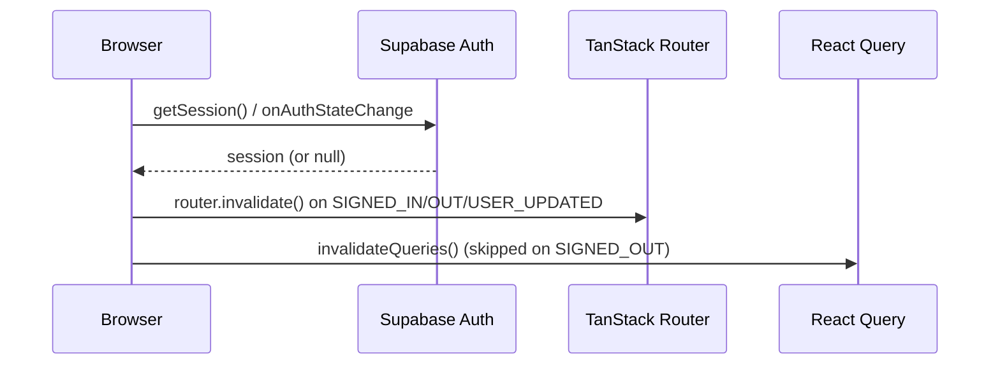
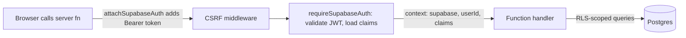

# SAKAN — Security Model

## Purpose

This document describes how SAKAN authenticates users, authorizes access to
data and server functions, protects secrets, and defends its public HTTP
surface. It reflects the implementation as of the current codebase — no
aspirational or planned controls are included. Where a control is partial or
has a known limitation, it is called out explicitly.

SAKAN runs on **Lovable Cloud** (a managed Supabase-compatible backend). This
document never references a project dashboard, project ID, or secret value.

## Table of Contents

1. [Authentication](#authentication)
2. [Authorization and Role Hierarchy](#authorization-and-role-hierarchy)
3. [Row-Level Security (RLS) Model](#row-level-security-rls-model)
4. [Protected Route Gate](#protected-route-gate)
5. [Server Function Bearer Middleware](#server-function-bearer-middleware)
6. [Admin Client Usage Rules](#admin-client-usage-rules)
7. [Stripe Webhook Signature Verification](#stripe-webhook-signature-verification)
8. [Push Dispatch Token](#push-dispatch-token)
9. [Storage Buckets](#storage-buckets)
10. [Secrets Inventory](#secrets-inventory)
11. [Rate Limiting](#rate-limiting)
12. [Input Validation](#input-validation)
13. [Session Handling and Offline Tolerance](#session-handling-and-offline-tolerance)
14. [Threat Model and Assumptions](#threat-model-and-assumptions)
15. [Best Practices](#best-practices)
16. [Troubleshooting](#troubleshooting)

Related: [DEPLOYMENT.md](./DEPLOYMENT.md) · [TESTING.md](./TESTING.md)

## Authentication

Authentication is delegated entirely to Supabase Auth (`@supabase/supabase-js`),
accessed through the browser client at `src/integrations/supabase/client.ts`.

- **Client state**: `src/hooks/useAuth.tsx` exposes an `AuthProvider` /
  `useAuth()` pair built on `supabase.auth.onAuthStateChange` and
  `supabase.auth.getSession()`. It tracks `session`, `user`,
  `isAuthenticated`, and `isLoading`, and reacts to `SIGNED_IN`, `SIGNED_OUT`,
  and `USER_UPDATED` events by invalidating the TanStack Router match tree and
  the React Query cache (`router.invalidate()`, `queryClient.invalidateQueries()`).
  On sign-out it cancels in-flight queries and clears the query cache before
  calling `supabase.auth.signOut()`, preventing stale authenticated data from
  flashing on screen.
- **Auth routes**: sign-in/sign-up/onboarding flows live under
  `src/routes/auth*` (and `/_authenticated/onboarding`) and call the Supabase
  client directly; there is no custom password or token handling in
  application code.
- **New Supabase API key compatibility**: both the browser client and every
  generated server client (`auth-middleware.ts`, `client.server.ts`) detect
  the newer opaque `sb_publishable_…` / `sb_secret_…` key formats and strip a
  stray `Authorization: Bearer <api-key>` header before attaching `apikey`,
  avoiding an auth error when these key formats are in use.



## Authorization and Role Hierarchy

Roles are stored in a dedicated `public.user_roles` table — **never** as a
column on `profiles`, which prevents a client-writable profile update from
granting privilege. The `app_role` enum defines, in increasing trust order:

| Role | Enum value | Granted by |
|---|---|---|
| Member | `user` | Default role assigned on signup |
| Moderator | `moderator` | Assigned by an admin |
| Admin | `admin` | Assigned by an admin/super admin |
| Super admin | `super_admin` | Added via a later migration (`ALTER TYPE public.app_role ADD VALUE`) |

Authorization is expressed through `SECURITY DEFINER` SQL functions, callable
from both RLS policies and server code via `supabase.rpc(...)`:

| Function | Returns true when | Used for |
|---|---|---|
| `has_role(_user_id, _role)` | The user holds the exact role | Fine-grained checks (e.g., admin-only tables) |
| `is_staff(_user_id)` | Role is `admin`, `moderator`, or `super_admin` | Moderation queues, review tooling |
| `is_super_admin(_user_id)` | Role is `super_admin` | Highest-privilege operations (e.g., role management); `REVOKE EXECUTE … FROM anon` |

Server-side, `src/lib/admin/admin.server.ts` wraps these RPCs:

```ts
export async function assertStaff(supabase: CallerClient, userId: string): Promise<void> {
  const { data, error } = await supabase.rpc("is_staff", { _user_id: userId });
  if (error || !data) throw new AdminForbiddenError();
}

export async function assertAdmin(supabase: CallerClient, userId: string): Promise<void> {
  const { data, error } = await supabase.rpc("has_role", { _user_id: userId, _role: "admin" });
  if (error || !data) throw new AdminForbiddenError();
}
```

Both helpers call the RPC through the **caller's own RLS-bound client**
(the client attached by `requireSupabaseAuth`, see below) rather than the
admin client, so the authorization decision itself is subject to the
database's own row visibility rules for `user_roles`.

> **Note:** `has_role`/`is_staff`/`is_super_admin` are `SECURITY DEFINER`
> functions, so they can read `user_roles` regardless of the RLS policy on
> that table — this is intentional and is how an authenticated, non-staff
> user's own role lookup succeeds without being granted broad `SELECT` on the
> roles table.

## Row-Level Security (RLS) Model

Every application table is protected by Postgres RLS. Two structural patterns
recur across the migrations in `supabase/migrations/`:

- **Ownership policies** — `USING (auth.uid() = owner_column)` — cover
  member-owned rows (profiles, gallery, messages, chat wallpapers, calls,
  notifications, etc.).
- **Staff/admin overrides** — policies gated by `is_staff(auth.uid())`,
  `has_role(auth.uid(), 'admin')`, or `is_super_admin(auth.uid())` — grant
  moderation, reporting, and administrative tables read/write access to
  elevated roles only. For example:

  ```sql
  FOR SELECT TO authenticated USING (public.is_staff(auth.uid()));
  ...
  USING (public.is_staff(auth.uid())) WITH CHECK (public.is_staff(auth.uid()));
  ```

- Some policies additionally exclude staff from self-serve paths, e.g.
  `AND NOT public.is_staff(auth.uid())`, to stop staff accounts from using a
  member-facing mutation to bypass moderation review.

Because authorization is enforced at the database layer, a compromised or
buggy server function that forwards the caller's own token (rather than the
admin client) cannot read or write rows the caller isn't entitled to — RLS is
the last line of defense even if application-level checks are skipped.

## Protected Route Gate

Authenticated pages live under the `/_authenticated` route tree, guarded in
`src/routes/_authenticated/route.tsx`:

```ts
export const Route = createFileRoute("/_authenticated")({
  ssr: false,
  beforeLoad: async () => {
    const user = await resolveGuardUser();
    if (!user) throw redirect({ to: "/auth" });
    return { user };
  },
  component: AppShell,
});
```

`resolveGuardUser()` (`src/lib/auth/offline-session.ts`) is deliberately
**offline-tolerant**: a dead network must never be indistinguishable from a
signed-out user, or a user would be redirected out of the app the moment
connectivity drops. The logic:

1. Read the locally cached session via `supabase.auth.getSession()`.
2. If the browser reports `navigator.onLine === false`, trust the cached
   session immediately (no network round-trip is attempted).
3. Otherwise call `supabase.auth.getUser()` to revalidate the session against
   the server.
   - On success, return the freshly validated user.
   - On a *transport* failure (`AuthRetryableFetchError`, a raw `fetch`
     rejection, or a `status 0/undefined` response) — classified by
     `isNetworkAuthError()` — fall back to the cached session instead of
     signing the user out.
   - On any other error (e.g., an actually invalid/expired token), return
     `null`, which triggers the redirect to `/auth`.

> **Warning:** This tolerance trades a small window of staleness (a revoked
> session may still grant client-side route access while offline) for
> availability. Server functions and RLS are the actual authorization
> boundary — the route guard only controls client-side navigation.

## Server Function Bearer Middleware

Two complementary, auto-generated pieces wire the bearer token from the
browser to every TanStack Start server function:

- **Client-side attacher** (`src/integrations/supabase/auth-attacher.ts`)
  runs as function middleware in the browser and attaches
  `Authorization: Bearer <access_token>` to every server function call:

  ```ts
  export const attachSupabaseAuth = createMiddleware({ type: "function" }).client(
    async ({ next }) => {
      const { data } = await supabase.auth.getSession();
      const token = data.session?.access_token;
      return next({ headers: token ? { Authorization: `Bearer ${token}` } : {} });
    },
  );
  ```

- **Server-side guard** (`src/integrations/supabase/auth-middleware.ts`,
  `requireSupabaseAuth`) validates the header on the server before a function
  body runs:
  - Rejects missing headers, non-`Bearer` schemes, empty tokens, and tokens
    that are not well-formed JWTs (`token.split(".").length !== 3`).
  - Verifies the token via `supabase.auth.getClaims(token)` against a
    request-scoped Supabase client (no session persistence, no auto-refresh).
  - Rejects tokens without a `sub` claim.
  - On success, injects `{ supabase, userId, claims }` into the function
    context — `supabase` here is a client authenticated **as the caller**, so
    subsequent queries remain RLS-scoped by default.

- **Wiring** (`src/start.ts`) registers `attachSupabaseAuth` as a global
  `functionMiddleware` and layers two `requestMiddleware` entries:
  - `errorMiddleware` renders a generic HTML error page for unhandled
    exceptions instead of leaking a stack trace, while re-throwing responses
    that already carry a `statusCode`.
  - `createCsrfMiddleware({ filter: (ctx) => ctx.handlerType === "serverFn" })`
    is re-declared explicitly. Defining `src/start.ts` opts the app out of
    TanStack Start's automatic CSRF middleware installation, so this line is
    what restores CSRF protection for server functions.



> **Note:** Individual server functions opt into `requireSupabaseAuth`; it is
> not a route-level guard covering every function automatically. Review each
> `*.functions.ts` module to confirm it is applied where authentication is
> required.

## Admin Client Usage Rules

`src/integrations/supabase/client.server.ts` exports `supabaseAdmin`, a
service-role client that **bypasses RLS**. Its usage is constrained by
convention enforced in code comments and file naming:

- The file is suffixed `.server.ts`; route files and `*.functions.ts` modules
  ship to the client bundle, so top-level imports of `client.server.ts` are
  only safe from other `.server.ts` modules.
- Everywhere else, the admin client is loaded with a **dynamic import inside
  the handler body**, e.g.:

  ```ts
  const { supabaseAdmin } = await import("@/integrations/supabase/client.server");
  ```

  This pattern appears consistently in `stripe-webhook.ts`,
  `push-dispatch.ts`, and other public/server routes, ensuring the
  service-role key and its client are never pulled into a client-side bundle.
- `supabaseAdmin` itself is a lazily-initialized `Proxy` — the underlying
  client (and its required env vars) is only constructed on first property
  access, so importing the module without using it does not require
  `SUPABASE_SERVICE_ROLE_KEY` to be present.

> **Warning:** Any code path that uses `supabaseAdmin` is responsible for its
> own authorization checks (e.g., `assertStaff`/`assertAdmin`, a verified
> webhook signature, or a token comparison) since RLS no longer applies. Every
> current use in this codebase pairs the admin client with such a check.

## Stripe Webhook Signature Verification

`POST /api/public/stripe-webhook` (`src/routes/api/public/stripe-webhook.ts`)
is a public, unauthenticated endpoint whose only protection is Stripe's
signature scheme, implemented from scratch in
`src/lib/billing/stripe.server.ts` (`verifyStripeEvent`):

1. Return `503` immediately if `STRIPE_WEBHOOK_SECRET` is not configured.
2. Parse the `Stripe-Signature` header into its `t` (timestamp) and `v1`
   (HMAC) components; reject malformed headers.
3. Reject requests whose timestamp is more than 300 seconds (default
   tolerance) from now, mitigating replay of captured payloads.
4. Recompute `HMAC-SHA256(secret, "${t}.${payload}")` using Web Crypto and
   compare it to `v1` with a constant-time `safeEqual` (XOR-accumulator,
   length-checked first).
5. Only after verification does the handler parse and act on the event body.

Idempotency is layered on top: the handler claims the Stripe event ID in a
`webhook_events` table via a plain `insert`, treating a unique-constraint
violation (`23505`) as "already processed" and acknowledging without
reprocessing. If a handler throws after claiming, the row is deleted so
Stripe's retry can reclaim and reprocess the event.

## Push Dispatch Token

`POST /api/public/push-dispatch` (`src/routes/api/public/push-dispatch.ts`) is
invoked by a database trigger/cron job to fan out a notification to Web Push
subscribers. Since the route is public, the **only** gate is a shared-secret
header compared in constant time:

```ts
function safeEqual(a: string, b: string): boolean {
  if (a.length !== b.length) return false;
  let diff = 0;
  for (let index = 0; index < a.length; index += 1) diff |= a.charCodeAt(index) ^ b.charCodeAt(index);
  return diff === 0;
}
...
const expected = process.env["PUSH_DISPATCH_TOKEN"];
const provided = request.headers.get("x-push-token") ?? "";
if (!expected || !safeEqual(provided, expected)) {
  return new Response("Unauthorized", { status: 401 });
}
```

The request body is additionally validated with Zod
(`z.object({ notificationId: z.string().uuid() })`) before any database
access, and the handler is a no-op (`{ skipped: true }`) if VAPID keys are not
configured.

> **Warning:** `PUSH_DISPATCH_TOKEN` must be treated as a bearer credential:
> anyone who obtains it can trigger push delivery for arbitrary existing,
> unread, unsent notification rows. It is only ever sent from the database
> trigger to this route over HTTPS and must never be logged or embedded in
> client-reachable code.

## Storage Buckets

Supabase Storage buckets used by the app (`avatars`, `gallery`, `wallpapers`,
`chat-media`, `featured`) are private by default (`public = false`, see the
`chat-media` bucket creation:
`INSERT INTO storage.buckets (id, name, public) VALUES ('chat-media', 'chat-media', false)`),
with access mediated by `storage.objects` RLS policies rather than public
URLs:

- **Ownership policies** (`storage_owner_insert/select/update/delete`) scope
  access to the first path segment matching the caller's UID
  (`(storage.foldername(name))[1] = auth.uid()::text` convention), i.e. object
  paths are namespaced as `<user_id>/<file>`.
- **Member-visible imagery** (`storage_members_view_imagery`) and a narrow
  **anonymous showcase policy** (`storage_public_showcase_imagery`) allow
  read access to specific profile imagery only when the owning profile
  matches showcase criteria — anonymous access is not a blanket bucket-public
  grant.
- **Staff review** (`storage_staff_review`) grants staff read access for
  moderation.
- **Featured bucket** (`featured_bucket_read`) is readable by `anon` and
  `authenticated` only for images attached to a currently active
  `featured_ads` row (`status = 'active' AND (ends_at IS NULL OR ends_at > now())`).
- Time-limited access to otherwise private objects (e.g., avatars, gallery,
  wallpapers) is granted via short-lived **signed URLs**
  (`createSignedUrl`/`createSignedUrls`), generated server-side or through the
  RLS-scoped client, with expirations ranging from 30 minutes
  (`admin/ops.server.ts`) to 6 hours (chat wallpapers).

## Secrets Inventory

The following server-only environment variable names are referenced in code
(`process.env[...]`). Names only — no values are stored in this repository or
documented here:

| Variable | Purpose |
|---|---|
| `SUPABASE_URL` | Backend project URL (server clients) |
| `SUPABASE_PUBLISHABLE_KEY` | Publishable API key used by the request-scoped auth client |
| `SUPABASE_SERVICE_ROLE_KEY` | Service-role key backing `supabaseAdmin` (bypasses RLS) |
| `STRIPE_SECRET_KEY` | Live Stripe secret key |
| `STRIPE_TEST_API_KEY` | Test-mode Stripe secret key, preferred outside production |
| `STRIPE_WEBHOOK_SECRET` | HMAC secret for verifying `Stripe-Signature` |
| `PUSH_DISPATCH_TOKEN` | Shared secret gating `/api/public/push-dispatch` |
| `VAPID_PUBLIC_KEY` / `VAPID_PRIVATE_KEY` / `VAPID_SUBJECT` | Web Push (VAPID) identity for browser push |
| `TURN_URL` / `TURN_USERNAME` / `TURN_CREDENTIAL` | TURN server credentials for WebRTC calls |
| `LOVABLE_API_KEY` | Lovable Cloud platform API key |
| `NODE_ENV` | Selects live vs. test Stripe key precedence |

No `VITE_*` (client-exposed) environment variables are referenced in
application source; the Supabase browser client and public keys are injected
by the platform build rather than read from `import.meta.env` in this
codebase.

## Rate Limiting

`src/lib/rate-limit.server.ts` implements a minimal shared limiter,
`enforceRateLimit(key, limit, windowMs)`, backed by the existing
`activity_logs` table (no dedicated migration or in-memory store): it counts
rows written for a given key within the trailing window and throws
`RateLimitError` once `limit` is reached, then records a marker row for the
current call. **It fails open** — a query error against `activity_logs` is
swallowed and the call is allowed, so a logging outage cannot cascade into an
unrelated feature outage.

Limits currently enforced in application code:

| Key prefix | Limit | Window | Location |
|---|---|---|---|
| `ad_checkout:<userId>` | 5 | 1 hour | `src/lib/ads/ads.functions.ts` |
| `ad_track:<adId>:<metric>` | 120 | 1 minute | `src/lib/ads/ads.functions.ts` |
| `ai:<userId>` (coaching) | `AI_LIMIT` per `AI_WINDOW_MS` | module-defined | `src/lib/ai/coaching.functions.ts` |
| `ai:<userId>` (matchmaking) | 20 | 1 minute | `src/lib/ai/matchmaking.functions.ts` |
| `ai:<userId>` (moderation) | `AI_LIMIT` per `AI_WINDOW_MS` | module-defined | `src/lib/ai/moderation.functions.ts` |
| `ai:<userId>` (translate) | 40 | 1 minute | `src/lib/ai/translate.functions.ts` |
| `billing_checkout:<userId>` | 10 | 1 hour | `src/lib/billing/billing.functions.ts` |
| `billing_portal:<userId>` | 20 | 1 hour | `src/lib/billing/billing.functions.ts` |
| `call_start:<userId>` | 20 | 10 minutes | `src/lib/calls/calls.functions.ts` |
| `pwa_install:<eventType>` | 600 | 1 minute | `src/lib/pwa/analytics.functions.ts` |

> **Note:** `AI_LIMIT`/`AI_WINDOW_MS` are shared constants imported by
> multiple AI-related function modules; consult the defining module for the
> current numeric values before relying on them in an incident.

## Input Validation

Server function and public-route inputs are validated with **Zod** before
touching the database or an external API, for example:

- `push-dispatch.ts`: `z.object({ notificationId: z.string().uuid() })`,
  checked with `safeParse` so a malformed body returns `400` rather than
  throwing.
- `src/lib/ai/moderation.functions.ts`: `moderateTextInput` and
  `moderateImageInput` schemas constrain what is sent to the moderation
  pipeline.

This pattern (schema defined near the handler, `safeParse`/`parse` at the top
of the function body) is used consistently across the `*.functions.ts`
modules under `src/lib/`.

## Session Handling and Offline Tolerance

- Sessions are persisted by the Supabase JS client's default storage
  (browser `localStorage`) and refreshed automatically by the client SDK.
- Request-scoped server clients created inside `requireSupabaseAuth` and
  `client.server.ts` explicitly disable persistence and auto-refresh
  (`persistSession: false`, `autoRefreshToken: false`, `storage: undefined`),
  since each server invocation is short-lived and stateless by design.
- The offline-tolerant guard (`resolveGuardUser`, described above) is the
  primary place where session validity intentionally trades strict
  freshness for availability; every server function still independently
  validates the bearer token via `requireSupabaseAuth`, so an offline client
  cannot use a stale local session to perform a privileged server-side
  mutation — only to keep client-rendered, previously-authenticated screens
  visible.

## Threat Model and Assumptions

**In scope / mitigated:**

- Forged or expired JWTs on server functions → rejected by
  `requireSupabaseAuth` (`getClaims` validation, `sub` presence, structural
  JWT check).
- Cross-site request forgery against server functions → `createCsrfMiddleware`.
- Replayed or forged Stripe webhook payloads → HMAC + timestamp-tolerance
  verification, idempotency table.
- Brute-forcing the push-dispatch token → constant-time comparison prevents
  timing side-channels (does not prevent low-rate guessing of a
  sufficiently long random token).
- Privilege escalation via a compromised profile update → roles live in a
  separate table, never on `profiles`.
- Cross-tenant data access → RLS is the enforcement layer for every table,
  independent of application-level bugs.
- Abuse of AI/billing/call/ad endpoints → per-user/per-entity rate limits.

**Explicitly out of scope / assumptions:**

- The rate limiter fails open on logging-store errors — a sustained
  `activity_logs` outage would remove rate limiting for the duration of the
  outage, not fail closed.
- The offline route guard is a UX affordance, not an authorization boundary;
  it must never be relied on as a security control.
- `PUSH_DISPATCH_TOKEN` and other shared secrets are assumed to be strong,
  randomly generated values managed by the platform's secret store; this
  document does not attempt secret strength enforcement.
- No automated security test suite exists in this repository (see
  [TESTING.md](./TESTING.md)); security-relevant regressions are currently
  caught only through manual QA and code review.

## Best Practices

- Always load `supabaseAdmin` via dynamic `import()` inside a handler, never
  as a top-level import in a client-reachable module.
- Pair every `supabaseAdmin` usage with an explicit authorization check
  (role assertion, signature verification, or token comparison) — RLS will
  not protect you.
- Add new server functions behind `requireSupabaseAuth` unless the route is
  intentionally public, and if public, document why (webhook signature,
  shared-secret token, etc.) directly in the route file, following the
  existing convention.
- Validate all external input with Zod at the boundary, using `safeParse` to
  return a clean `4xx` instead of throwing.
- When adding a new abuse-prone action, call `enforceRateLimit` with a
  namespaced key (`<feature>:<entity>`) consistent with the table above.
- New storage buckets should default to `public = false` and rely on RLS or
  signed URLs, matching every existing bucket in this project.

## Troubleshooting

| Symptom | Likely cause | Where to look |
|---|---|---|
| `Unauthorized: Invalid token` from a server function | Expired/garbled JWT, or client didn't attach the bearer header | `auth-attacher.ts`, `auth-middleware.ts` |
| User bounced to `/auth` while offline | `resolveGuardUser` treated the error as non-network | `src/lib/auth/offline-session.ts`, check `isNetworkAuthError` classification |
| Stripe webhook returns `invalid_signature` | Wrong/rotated `STRIPE_WEBHOOK_SECRET`, or payload re-encoded before verification | `stripe-webhook.ts` reads `request.text()` before any parsing — confirm no middleware mutates the body |
| Stripe webhook returns `webhook_not_configured` (503) | `STRIPE_WEBHOOK_SECRET` not set in the current environment | Deployment secret configuration |
| Push dispatch returns `401 Unauthorized` | `x-push-token` mismatch with `PUSH_DISPATCH_TOKEN` | Database trigger/cron header vs. current secret value |
| `403`/`AdminForbiddenError` on an admin action | Caller lacks the required role in `user_roles` | `admin.server.ts` (`assertStaff`/`assertAdmin`), `user_roles` table |
| `RateLimitError` under normal use | Limit/window too tight for the current usage pattern | Table in [Rate Limiting](#rate-limiting), adjust the call site |
